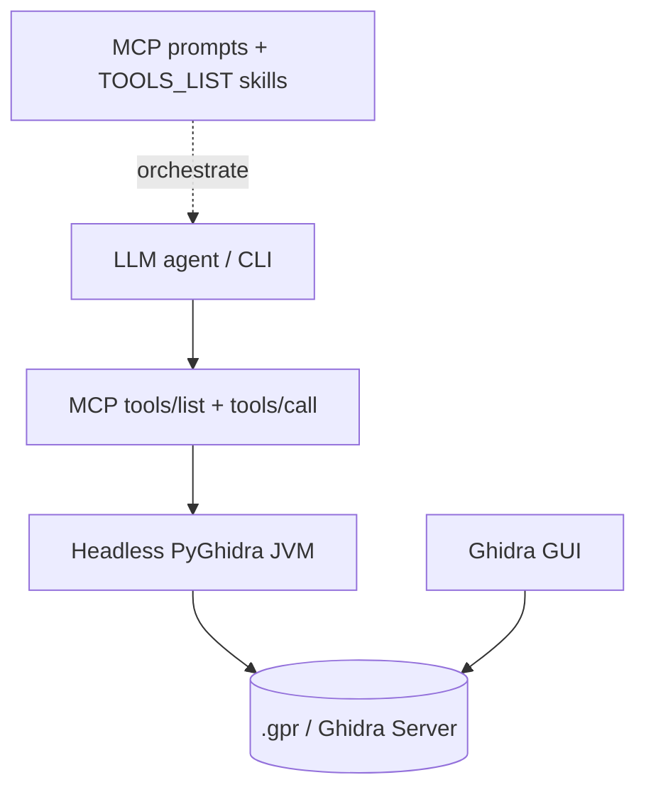

# Agent-Native Architecture Review — AgentDecompile

**Date:** 2026-05-24  
**Branch reviewed:** `impl/blocking-analysis-gate-c2bc`  
**Scope:** MCP server (`src/agentdecompile_cli/`), `TOOLS_LIST.md`, session/project model

## Overall Score Summary

| Core Principle | Score | Percentage | Status |
|----------------|-------|------------|--------|
| Action Parity | 40/42 core RE | 95% | ✅ |
| Tools as Primitives | 27/55 | 49% | ❌ |
| Context Injection | 4/6 | 67% | ⚠️ |
| Shared Workspace | 6/6 persisted RE | 100% | ✅ |
| CRUD Completeness | 5/10 entities | 50% | ⚠️ |
| UI Integration | 1.5/10 | 15% | ❌ |
| Capability Discovery | 5/7 | 71% | ⚠️ |
| Prompt-Native Features | 9 workflows + docs | ~71% delivery | ⚠️ |

**Overall agent-native score (weighted): ~66%** — strong Ghidra parity and shared persistence; weak live GUI sync and primitive-heavy tool surface.

### Status legend

- ✅ Excellent (80%+)
- ⚠️ Partial (50–79%)
- ❌ Needs work (&lt;50%)

---

## 1. Action Parity — 40/42 (95%) ✅

Ghidra static-RE workflows (project, shared VC, decompile, symbols, xrefs, structures, comments) map to MCP tools. Gaps: `rename-variable` / `set-local-variable-type` (registry aliases, no handler), enums, byte patching, program diff, debugger/GUI navigation.

## 2. Tools as Primitives — 27/55 (49%) ❌

Many advertised tools are multi-mode routers (`manage-*`, `open`, `search-everything`, `get-function`) or orchestration (`match-function`, `sync-project`, `analyze-program`). Curated surface hides some true primitives (`list-functions`) while keeping workflow bundles.

## 3. Context Injection — 4/6 (67%) ⚠️

`projectContext` on successful tool responses covers active program, open programs, project path. Missing from routine injection: `analysisComplete`, checkout state, Ghidra version (available only via `agentdecompile://debug-info`). No MCP `initialize` session preamble.

## 4. Shared Workspace — 6/6 (100%) ✅

Agents mutate the same Ghidra `Program` DB and persist via save/check-in to the same `.gpr` or shared server as the GUI. Session memory (`SESSION_CONTEXTS`) is process-local; not an anti-pattern for RE data. Coordinate checkout and `sync-project` across clients.

## 5. CRUD Completeness — 5/10 (50%) ⚠️

Full CRUD: functions, comments, bookmarks, structures, programs. Gaps: symbol delete, enum tools (docs only), data-type catalog CRUD, function-tag update, xrefs read-only by design.

## 6. UI Integration — 1.5/10 (15%) ❌

Headless-by-design: MCP JVM ≠ CodeBrowser JVM. Changes appear in GUI after save/check-in/sync/reopen, not live. Web UI is a tool console, not disassembly mirror.

## 7. Capability Discovery — 5/7 (71%) ⚠️

Strong: `TOOLS_LIST.md`, MCP `tools/list`, nine RE prompts, error `nextSteps`. Weak: no `/help`-style slash command, thin empty-state onboarding, CLI `tool --list-tools` names-only.

## 8. Prompt-Native Features — ⚠️

Server behavior is ~92% code/Ghidra (appropriate for RE MCP). Nine MCP workflow prompts exist; **`prompts/get` is not implemented** (listed but not fetchable). `suggest` tool is a stub.

---

## Top 10 Recommendations by Impact

| Priority | Action | Principle | Effort |
|----------|--------|-----------|--------|
| 1 | Implement `prompts/get` (render templates like Web UI) | Prompt-native / Discovery | Low |
| 2 | Add `manage-function` modes for rename/set variable type | Action parity | Medium |
| 3 | Expand `projectContext` with `analysisComplete`, checkout summary | Context injection | Low |
| 4 | Split or demote workflow tools in curated `tools/list`; expose list/search primitives | Tools as primitives | Medium |
| 5 | Add `manage-enums` or extend data-types for enum CRUD | CRUD / Action parity | Medium |
| 6 | Document `uiVisibility` on responses (headless vs persisted) | UI integration | Low |
| 7 | Add `agentdecompile://capabilities` resource or slash `/capabilities` | Discovery | Low |
| 8 | Fix or remove `suggest` stub; document client-LLM naming path | Prompt-native | Low |
| 9 | Add `ToolProviderManager` gate integration test | Testing (supports analysis gate) | Low |
| 10 | Forward `X-AgentDecompile-Project-Path` in HTTP proxy allowlist | Context / Shared workspace | Low |

---

## What's Working Excellently

1. **Ghidra-native persistence** — transactions, check-in, shared server; agents and humans share the same program database after save.
2. **Core RE action parity** — decompile, xref, search, symbols, structures, project lifecycle.
3. **MCP prompt workflows** — Scout/Diver/Bridge Builder etc. give agents structured RE playbooks.
4. **Passive session context** — `projectContext` footer on successful tools.
5. **Conflict + match-function** — agent-specific flows on top of Ghidra with clear handoff patterns.

---

## Relation to blocking analysis gate

The analysis gate (`program_analysis.py`) improves **agent-native safety**: non-exempt tools wait for real Ghidra analysis before reads/writes. Extend **context injection** with `analysisComplete` in `projectContext` so agents know when the gate has finished without reading debug-info.
