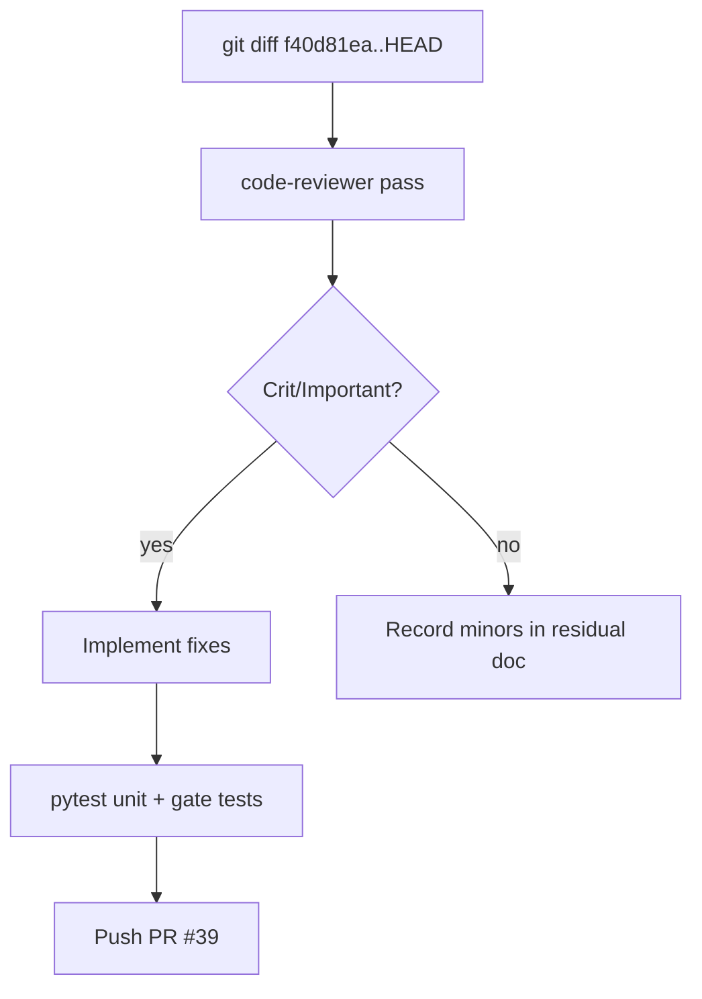

# Pre-merge code review (requesting-code-review)

## Objective

Run a structured review of branch `impl/blocking-analysis-gate-c2bc` vs `master` (`f40d81ea..HEAD`), fix **Critical** and **Important** issues before merge, and update residual tracking.

## Scope

| In scope | Out of scope |
|----------|----------------|
| Analysis gate, CLI agent help, DHH waiter consolidation | Webflow, browser UI |
| Residual items from prior reviews still open | Full `/lfg` Ghidra server harness |

## Origin plans

- [2026-05-24-blocking-program-analysis-gate.md](2026-05-24-blocking-program-analysis-gate.md)
- [2026-05-24-cli-agent-friendly-improvements.md](2026-05-24-cli-agent-friendly-improvements.md)
- [2026-05-24-dhh-style-python-simplification.md](2026-05-24-dhh-style-python-simplification.md)

## Review range

- **Base:** `f40d81ea`
- **Head:** `HEAD` (branch tip)

## Implementation units

1. **Review** — Dispatch code-reviewer on diff; categorize Critical / Important / Minor
2. **Fix Important** — Prioritize: shared import always-ensure, gate `programPath` resolution, `ProgramAnalysisTimeout` surfaced in MCP dispatch, integration test for gate
3. **Tests** — `tests/test_program_analysis_gate.py`, new `tests/test_tool_providers_analysis_gate.py` (unit, mocked)
4. **Residual doc** — Update `docs/residual-review-findings/impl-blocking-analysis-gate-c2bc.md` with closed vs open items

## Verification

- `uv run pytest tests/test_program_analysis_gate.py tests/test_cli_agent_help.py tests/test_tool_providers_analysis_gate.py -m unit -v`
- `uv run ruff check --no-fix` on touched paths

## Success criteria

- No open **Critical** or **Important** findings tied to analysis gate correctness
- Residual doc reflects fixes (swallow removed, timeout fail-closed, duplicate waiter removed)
