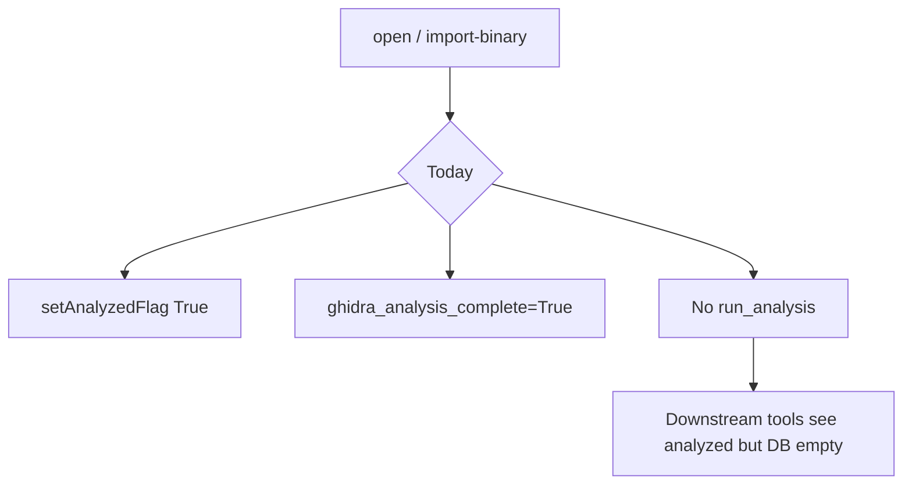
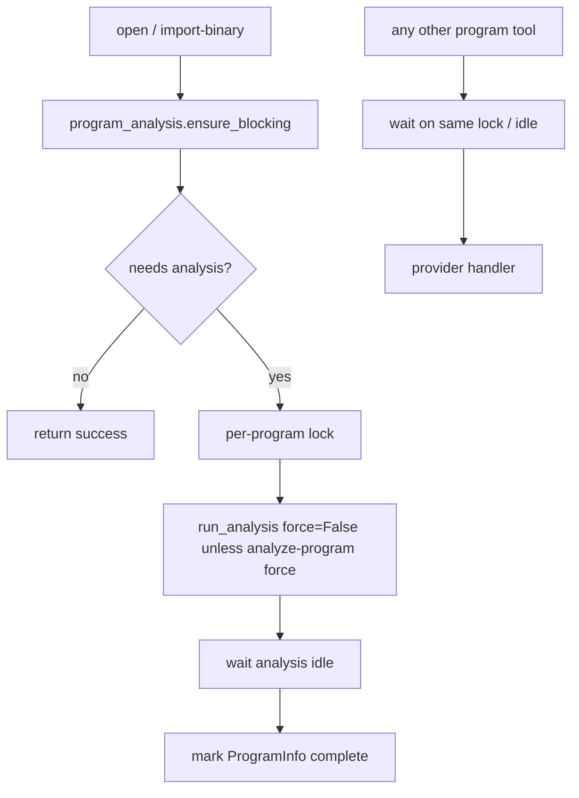

# Blocking program analysis gate

## Objective

Ensure `open` and `import-binary` always run real Ghidra auto-analysis (incremental when possible, never fake flags), and block all other program-scoped MCP tools until analysis for that program is complete.

## Current problems

- `project.py` sets `GhidraProgramUtilities.setAnalyzedFlag(True)` without running analyzers.
- `_set_active_program_info` and `_import_file` mark `ghidra_analysis_complete=True` before analysis.
- Local `import-binary` defaults `analyzeAfterImport` to `False` and never analyzes.
- No central lock: concurrent tools can mutate programs during auto-analysis.

## Target behavior

| Rule | Behavior |
|------|----------|
| Always try | `open` / `import-binary` call ensure after program is in memory (ignore `analyzeAfterImport=false` for skipping) |
| No overwrite | Use `shouldAskToAnalyze` / analysis state; `force_analysis=False` for ensure |
| Incremental | Run only when Ghidra reports missing analysis |
| Blocking | Hold per-program lock for duration of ensure; other tools acquire lock and wait |
| analyze-program | `force=true` may re-run; exempt from pre-dispatch wait |

## Implementation units

1. **`mcp_utils/program_analysis.py`** — lock registry, `program_needs_analysis`, `blocking_ensure_analyzed`, `wait_for_program_analysis_ready`
2. **`project.py`** — replace `setAnalyzedFlag`; call ensure after open/import/domain open; fix `ghidra_analysis_complete` defaults
3. **`import_export.py`** — local import path: ensure after each import; align schema default `analyzeAfterImport` to true; shared path unchanged except always analyze when PyGhidra path runs
4. **`tool_providers.py`** — before provider dispatch, `wait_for_program_analysis_ready` for program-scoped tools (exclude open, importbinary, analyzeprogram, list-only tools)
5. **Tests** — `tests/test_program_analysis_gate.py` (unit, mocked Ghidra)
6. **Docs** — `TOOLS_LIST.md` / `AGENTS.md` note on always-on incremental analysis

## Verification

- `uv run pytest tests/test_program_analysis_gate.py -m unit -v`
- `uv run ruff check --no-fix src/agentdecompile_cli/mcp_utils/program_analysis.py src/agentdecompile_cli/mcp_server/providers/project.py src/agentdecompile_cli/mcp_server/providers/import_export.py src/agentdecompile_cli/mcp_server/tool_providers.py tests/test_program_analysis_gate.py`

## LFG note

`/lfg` shared fixture step `01b` passes `analyzeAfterImport: false` to skip headless analysis time; with this change, import still runs incremental ensure when the program is opened in-session. Re-run LFG after merge to confirm label/search steps still pass.
