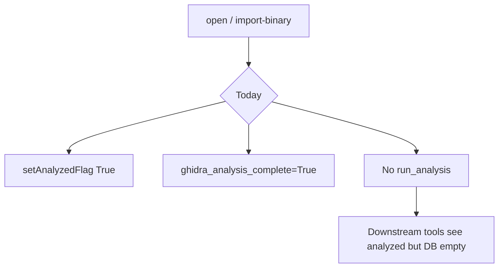
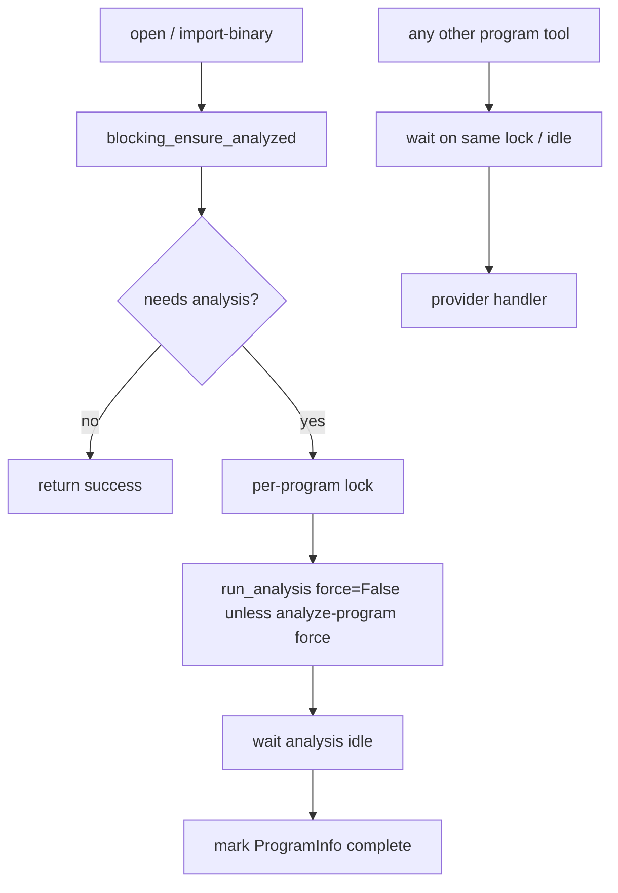

# Blocking program analysis gate

## Objective

Ensure `open` and `import-binary` run real Ghidra auto-analysis (incremental when possible, never fake flags) for every program loaded in the MCP PyGhidra session, and block all other program-scoped MCP tools until analysis for that program is complete.

## Current problems

- `project.py` sets `GhidraProgramUtilities.setAnalyzedFlag(True)` without running analyzers.
- `_set_active_program_info` and `_import_file` mark `ghidra_analysis_complete=True` before analysis.
- Open/import paths did not call real analysis while still advertising analyzed state.
- No central lock: concurrent tools can mutate programs during auto-analysis.

## Target behavior

| Rule | Behavior |
|------|----------|
| Always try (in-session) | After a `Program` is loaded in the MCP JVM, call `blocking_ensure_analyzed` — do not skip because `analyzeAfterImport=false` |
| Headless shared import | `analyzeAfterImport=false` may still pass `-noanalysis` to analyzeHeadless for import speed; ensure runs on first in-session open, checkout, or local PyGhidra import path |
| No overwrite | Use `shouldAskToAnalyze` / analysis state; `force=False` on ensure (`force_analysis=False` in ghidrecomp) |
| Incremental | Run only when Ghidra reports missing analysis |
| Blocking | Hold per-program lock for duration of ensure; other tools acquire lock and wait |
| analyze-program | `force=True` may re-run; exempt from pre-dispatch wait |
| Fail closed | Analysis idle timeout or ensure failure must not mark complete or dispatch mutating tools silently |

## analyzeAfterImport semantics

| Path | `analyzeAfterImport=false` effect | When ensure runs |
|------|-----------------------------------|------------------|
| Local PyGhidra `import-binary` | Does not skip ensure | Immediately after import |
| Shared PyGhidra in-process import | May skip `GhidraProgramUtilities.analyze` at import | On in-session open/checkout/activate |
| Shared analyzeHeadless subprocess | May use `-noanalysis` | On first in-session open/checkout (not at headless return) |

`analyzeAfterImport` remains in the schema for backward compatibility and `analysisRequested` metadata; it must not imply “skip all analysis forever.”

## Implementation units

1. **`src/agentdecompile_cli/mcp_utils/program_analysis.py`** — lock registry, `program_needs_analysis`, `blocking_ensure_analyzed`, `wait_for_program_analysis_ready`, `_ANALYSIS_GATE_EXEMPT_TOOLS`
2. **`src/agentdecompile_cli/mcp_server/providers/project.py`** — replace `setAnalyzedFlag`; call ensure after open/import/domain open and eager-open secondaries; fix `ghidra_analysis_complete` defaults
3. **`src/agentdecompile_cli/mcp_server/providers/import_export.py`** — ensure after each local import and fallback import; schema default `analyzeAfterImport` true; shared analyzeHeadless may keep `-noanalysis` when false but in-session paths must ensure
4. **`src/agentdecompile_cli/mcp_server/tool_providers.py`** — before provider dispatch, `wait_for_program_analysis_ready` for program-scoped tools; exempt normalized tools: `open`, `importbinary`, `analyzeprogram`, `listprojectfiles`, `listtools`, `connectsharedproject`, `syncproject`, `svradmin`, `debuginfo`, `getcurrentprogram`, `checkoutprogram`, `checkinprogram`, `checkoutstatus` (see `_ANALYSIS_GATE_EXEMPT_TOOLS`; VC exempt added post-merge in [#43](https://github.com/bolabaden/AgentDecompile/pull/43))
5. **Tests** — `tests/test_program_analysis_gate.py` and `tests/test_tool_providers_analysis_gate.py` (unit, mocked Ghidra + dispatch gate)
6. **Docs** — `TOOLS_LIST.md` / `AGENTS.md` / `docs/solutions/` learnings for gate and coordinator pattern

## Requirements traceability

| ID | Requirement | Implementation |
|----|-------------|----------------|
| R1 | Real analysis on open/import; no fake analyzed flags | `program_analysis.py`, `project.py`, `import_export.py` |
| R2 | Block non-exempt tools until analysis ready | `tool_providers.py` + `_ANALYSIS_GATE_EXEMPT_TOOLS` |
| R3 | Fail-closed on analysis timeout | `ProgramAnalysisTimeout`, MCP `analysis-timeout` |
| R4 | Requested `programPath` does not fall back to active program for gate | `tool_providers.py` resolution |
| R5 | Unit coverage for gate and dispatch | `tests/test_program_analysis_gate.py`, `tests/test_tool_providers_analysis_gate.py` |

## Verification

- `uv run pytest tests/test_program_analysis_gate.py tests/test_tool_providers_analysis_gate.py -m unit -v`
- `uv run ruff check --no-fix src/agentdecompile_cli/mcp_utils/program_analysis.py src/agentdecompile_cli/mcp_server/providers/project.py src/agentdecompile_cli/mcp_server/providers/import_export.py src/agentdecompile_cli/mcp_server/tool_providers.py tests/test_program_analysis_gate.py`
- Post-merge: canonical `/lfg` (`scripts/lfg_validation.py` or `scripts/lfg_cmd_sequence.ps1`) — step `01b` uses `analyzeAfterImport: false`; assert `search-symbols` for `sh_<RUN_ID>_L*` after checkout (step `02d` / `05`) before declaring done

## LFG note

`/lfg` shared fixture step `01b` passes `analyzeAfterImport: false` to skip headless analyzeHeadless time. Incremental ensure must run **before** step `02d` `search-symbols` (typically on first `checkout-program` / `open` in the same MCP session). Re-run `/lfg` after merge to confirm label/search steps still pass within `LFG_TOOL_SEQ_TIMEOUT`.
