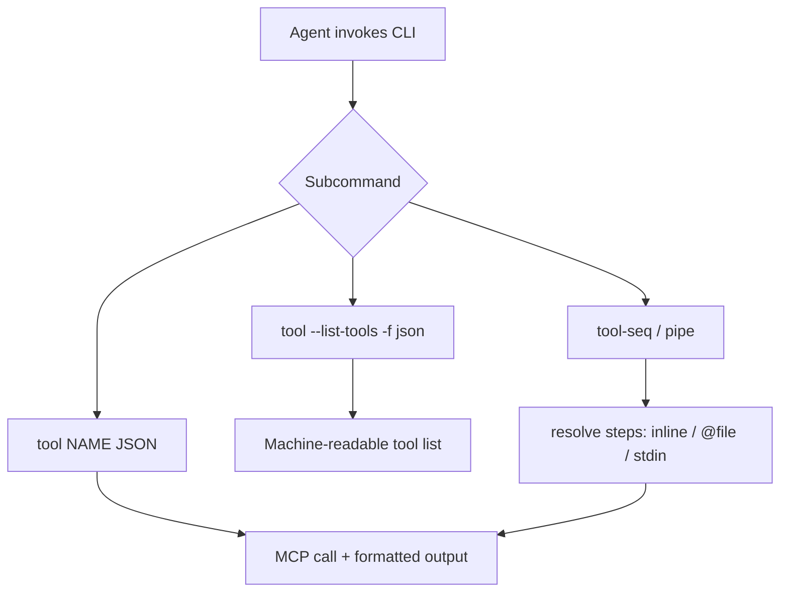

# CLI agent-friendly improvements

## Objective

Make `agentdecompile-cli` reliable for headless coding agents: copy-pasteable `--help` examples, JSON tool discovery, stdin pipelines for `tool-seq`, and actionable usage errors (per cli-for-agents skill).

## Scope

| In scope | Out of scope |
|----------|----------------|
| `tool`, `tool-seq`, `tool-seq-file` help and I/O | Rewriting all dynamic subcommands |
| `--list-tools` JSON output via global `-f json` | Interactive TUI or menus |
| `tool-seq` stdin (`-` / `--stdin`) | New MCP tools |

## Flow

## Implementation units

1. **`src/agentdecompile_cli/cli_agent_help.py`** — epilog strings, `format_tool_list_output()`, `resolve_tool_seq_steps()`, usage error text helpers
2. **`src/agentdecompile_cli/cli.py`** — wire epilogs; JSON `--list-tools`; stdin for `tool-seq`; improved `UsageError` / JSON error messages
3. **`tests/test_cli_agent_help.py`** — unit tests for helpers and CliRunner smoke tests (no live server)

## Requirements traceability

| cli-for-agents principle | Implementation |
|--------------------------|----------------|
| Non-interactive first | No new prompts; `--stdin` flag |
| Layered `--help` | Epilog **Examples** on `main`, `tool`, `tool-seq` |
| stdin / pipelines | `tool-seq --stdin` or steps arg `-` |
| Fail fast | Usage errors include example invocations |
| Structured success | `tool --list-tools -f json` → `{"tools":[...],"count":N}` |

## Test scenarios

- `format_tool_list_output(..., "json")` parses as JSON with `tools` array
- `resolve_tool_seq_steps(None, stdin=True)` reads mocked stdin
- `resolve_tool_seq_steps("@/tmp/x.json", False)` reads file (temp file)
- CliRunner: `tool` without NAME exits non-zero and output contains `Examples`
- CliRunner: `tool --list-tools -f json` exits 0 and output is valid JSON

## Verification

- `uv run pytest tests/test_cli_agent_help.py -m unit -v`
- `uv run ruff check --no-fix src/agentdecompile_cli/cli_agent_help.py src/agentdecompile_cli/cli.py tests/test_cli_agent_help.py`
