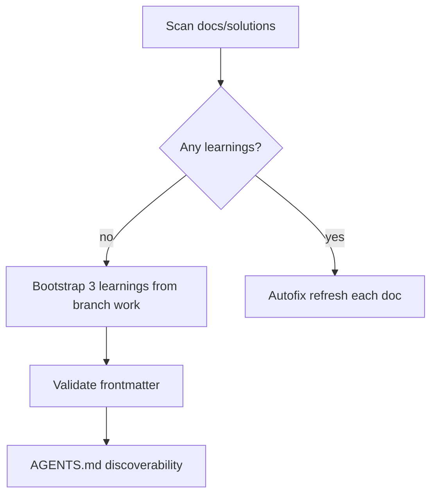

# Compound refresh bootstrap

## Objective

Run `ce-compound-refresh` on this repo. The knowledge store `docs/solutions/` did not exist; bootstrap it from verified learnings on branch `impl/blocking-analysis-gate-c2bc`, add discoverability in `AGENTS.md`, and install frontmatter validation script.

## Flow

## Scope

| In scope | Out of scope |
|----------|----------------|
| Initial learnings for analysis gate, program_analysis, CLI agents | Refreshing non-existent stale docs |
| `docs/solutions/README.md` | Full pattern library |
| `scripts/validate-frontmatter.py` (copied from ce-compound skill) | Modifying application code |

## Implementation units

1. **`docs/solutions/README.md`** — index and category map
2. **Learnings** (verified on branch, 38 unit tests):
   - `docs/solutions/integration-issues/mcp-program-analysis-gate.md`
   - `docs/solutions/architecture-patterns/program-analysis-coordinator.md`
   - `docs/solutions/developer-experience/agentdecompile-cli-agent-ergonomics.md`
3. **`scripts/validate-frontmatter.py`** — parser-safety validator for new docs
4. **`AGENTS.md`** — `docs/solutions/` discoverability line

## Verification

- `python3 scripts/validate-frontmatter.py` on each new learning path (exit 0)
- `uv run pytest tests/test_program_analysis_gate.py tests/test_tool_providers_analysis_gate.py tests/test_cli_agent_help.py -m unit -q`

## Compound refresh outcome (autofix)

- Scanned: 0 existing → bootstrapped 3 new (treated as Replace-from-evidence, not stale refresh)
- Future runs refresh these against `src/agentdecompile_cli/mcp_utils/program_analysis.py`, `tool_providers.py`, `cli_agent_help.py`
