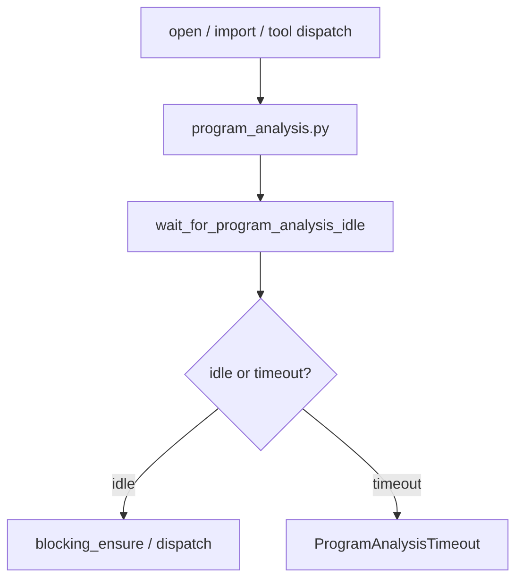

# DHH-style Python simplification

## Objective

Apply 37signals/DHH principles to the Python MCP codebase (no Rails in this repo): **one obvious place** for behavior, **fix root causes**, **no duplicate coordinators**, **fail loud** instead of silent timeouts or swallowed errors.

## DHH → Python mapping

| Rails / DHH | AgentDecompile |
|-------------|----------------|
| Rich models, thin controllers | `program_analysis.py` owns wait/ensure; providers call it |
| No parallel service layers | Remove `ImportExportToolProvider._wait_for_program_analysis_idle` duplicate |
| Fix root cause, not symptoms | Raise on analysis idle timeout; do not mark complete after timeout |
| Obvious code | Drop `_blocking_ensure_program_analyzed` try/except that only logs |

## Flow

## Implementation units

1. **`program_analysis.py`** — `ProgramAnalysisTimeout`; `wait_for_program_analysis_idle` raises when `max_wait_sec` elapses while analysis still running
2. **`import_export.py`** — delete duplicate waiter; call shared `wait_for_program_analysis_idle`
3. **`project.py`** — `_blocking_ensure_program_analyzed` calls `blocking_ensure_analyzed` directly (no swallow)
4. **`tests/test_program_analysis_gate.py`** — timeout unit test

## Out of scope

- Rails-specific patterns (Minitest, Turbo, concerns)
- Broad refactors of `GhidraTools` or all providers

## Verification

- `uv run pytest tests/test_program_analysis_gate.py tests/test_cli_agent_help.py -m unit -v`
- `uv run ruff check --no-fix` on touched files
