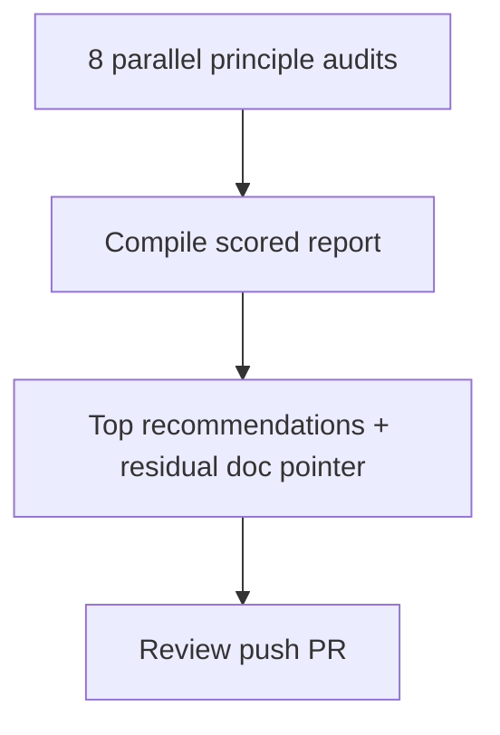

# LFG — Agent-native architecture audit

## Objective

Run **ce-agent-native-audit** against AgentDecompile (Python MCP + CLI + Ghidra workspace). Produce a scored report under `docs/audits/` with actionable gaps, especially for `/lfg` and MCP tool parity. Ship via PR.

## Flow

## Requirements

| ID | Requirement | Verification |
|----|-------------|--------------|
| R1 | Report covers all 8 principles with X/Y scores | `docs/audits/2026-05-24-agent-native-audit.md` |
| R2 | Includes `/lfg` and MCP tool parity section | Report references `TOOLS_LIST.md`, `scripts/lfg_validation.py` |
| R3 | Mermaid summary diagram in report | Per `.cursorrules` diagram policy |
| R4 | Branch pushed with audit doc | PR open |

## Scope boundaries

- **In scope:** Audit document, optional small doc cross-links (AGENTS.md one-liner).
- **Out of scope:** Implementing all audit recommendations; Ghidra GUI changes.

## Implementation units

### IU1 — Audit report

File: `docs/audits/2026-05-24-agent-native-audit.md`

### IU2 — Residual pointer (optional)

Update `docs/residual-review-findings/` if P1 gaps need tracking.

## Verification

Manual review of report completeness; no test changes required.
