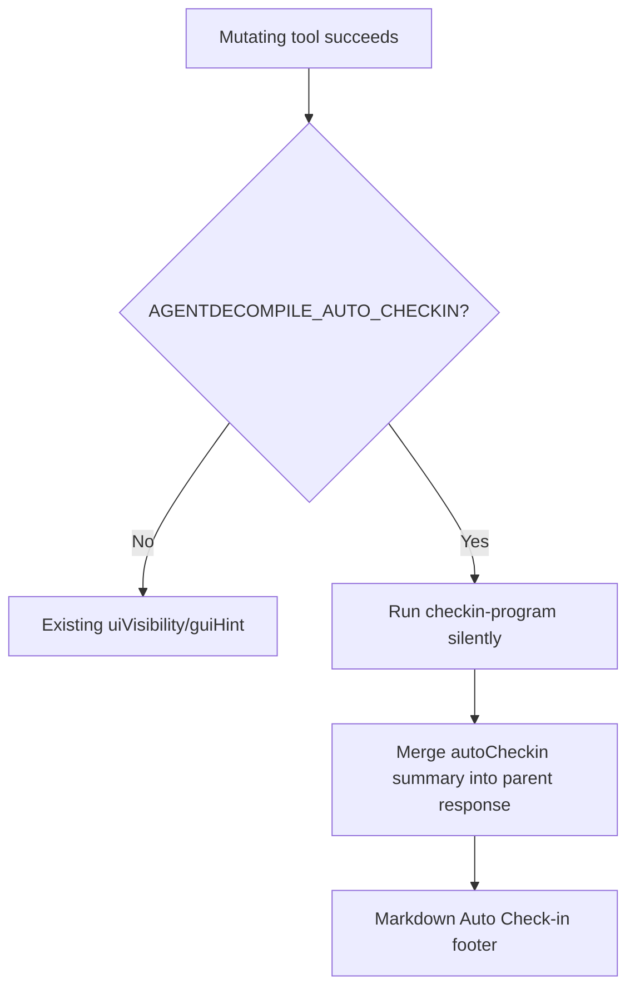

# LFG — Surface auto-checkin in mutating tool response footer

## Summary

When `AGENTDECOMPILE_AUTO_CHECKIN` is enabled, the server silently runs `checkin-program` after mutating tools but discards the result. Agents only see `guiHint` saying auto-checkin is enabled — not whether persistence succeeded. Attach an **`autoCheckin`** summary to the mutating tool's JSON response and markdown footer.



---

## Problem Frame

UI Integration audit lists **Auto-checkin (silent persist)** as ⚠️ and recommends surfacing it in the response footer when env is enabled. `uiVisibility.autoCheckinEnabled` and `guiHint` pre-declare the mode but do not report the outcome of the silent check-in.

---

## Requirements

| ID | Requirement |
|----|-------------|
| R1 | After silent auto-checkin, parent mutating tool JSON includes `autoCheckin` with `performed`, `success`, `count`, and compact `results` or `hint` |
| R2 | Markdown `render_tool_response` shows **Auto Check-in** footer when `autoCheckin` present |
| R3 | On checkin failure, `autoCheckin.success` is false with error/hint; do not fail the parent mutation response |
| R4 | Unit tests for summarize helper, merge logic, and markdown footer |
| R5 | Audit UI Integration recommendation #2 marked Done |

---

## Scope Boundaries

- No change to when auto-checkin runs (existing middleware)
- No new env vars; reuse `_auto_checkin_enabled()`
- Read-only tools unchanged

---

## Implementation Units

- U1. **`summarize_auto_checkin_result()` + `attach_auto_checkin_to_payload()`** in `program_metadata.py`
- U2. **Merge checkin result** in `ToolProviderManager.call_tool` after silent checkin
- U3. **Markdown footer** in `response_formatter.py`
- U4. **Tests** `tests/test_auto_checkin_footer.py`
- U5. **Audit sync** `docs/audits/2026-05-24-agent-native-audit.md`

---

## Verification

```bash
uv run pytest tests/test_auto_checkin_footer.py tests/test_ui_hints.py -m unit -q --timeout=60
uv run pytest -m unit -q --timeout=120
```
