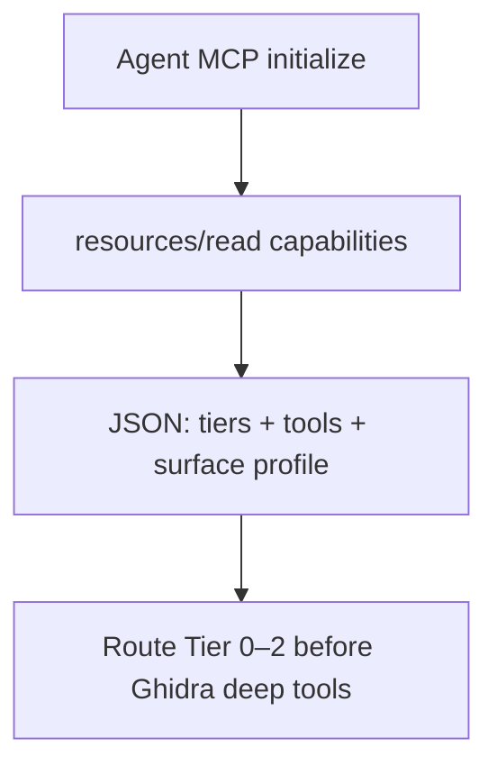

# LFG — agentdecompile://capabilities MCP resource

## Objective

Add MCP resource `agentdecompile://capabilities` so agents discover tools, tiers, and surfaces without calling `tools/list` or reading slash-command docs. Closes the top future item from tiered RE KB and agent-native audit discovery gap.



## Requirements

| ID | Requirement |
|----|-------------|
| R1 | `ResourceUri.CAPABILITIES = agentdecompile://capabilities` in `registry.py`; included in `RESOURCE_URIS` |
| R2 | `CapabilitiesResource` in `mcp_server/resources/capabilities.py` — `list_resources` + `read_resource` |
| R3 | Payload: tier routing summary (0–3), `active_tool_surface_profile`, per-tool `{name, advertised, analysis_tier, profiles, metadata}` |
| R4 | Register provider in `ResourceProviderManager._init_providers` |
| R5 | Shared builder (avoid duplicating `server._build_tool_reference_payload`) — extract or reuse via importable function |
| R6 | Unit tests: `tests/test_capabilities_resource.py` — list includes URI, read returns valid JSON with tier fields |
| R7 | Cross-link in `.cursor/commands/capabilities.md` and KB future-extensions note |

## Out of scope

- Runtime `tools/list` filter by max tier
- Tier 0 MCP wrappers (capa/yara/binwalk)
- Dependabot #61

## Files

| File | Change |
|------|--------|
| `src/agentdecompile_cli/registry.py` | `ResourceUri.CAPABILITIES`, constant export |
| `src/agentdecompile_cli/mcp_utils/tool_reference.py` | Shared `build_tool_reference_payload()` |
| `src/agentdecompile_cli/mcp_server/server.py` | Import shared builder |
| `src/agentdecompile_cli/mcp_server/resources/capabilities.py` | New resource provider |
| `src/agentdecompile_cli/mcp_server/resource_providers.py` | Register provider |
| `src/agentdecompile_cli/mcp_server/resources/__init__.py` | Export |
| `tests/test_capabilities_resource.py` | Unit tests |

## Test scenarios

- T1: `CapabilitiesResource.list_resources()` returns resource with URI `agentdecompile://capabilities`
- T2: `read_resource` returns JSON with `tiers`, `summary`, `tools` keys
- T3: At least one tool has `analysis_tier` 2 and one has 3
- T4: `RESOURCE_URIS` includes capabilities URI

## Verification

```bash
uv run pytest tests/test_capabilities_resource.py -m unit -v
uv run pytest -m unit -q --timeout=120
```
