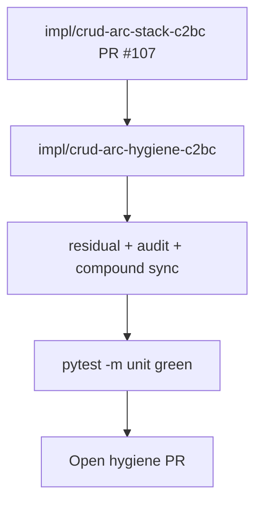

# LFG — CRUD arc hygiene

## Summary

Document ship status for stack PR **#107** (`impl/crud-arc-stack-c2bc`), update audit/residual/compound cross-links, and note superseded feature PRs **#105** and **#106** — mirroring discovery arc hygiene (#104).



---

## Requirements

| ID | Requirement | Verification |
|----|-------------|--------------|
| R1 | Residual doc lists #107 URL and superseded #105–#106 | `docs/residual-review-findings/impl-agent-native-audit-c2bc.md` |
| R2 | Residual doc lists #107 and superseded #105–#106 | `docs/residual-review-findings/impl-agent-native-audit-c2bc.md` |
| R3 | Compound doc stub + solutions index entry (open PR context) | `docs/solutions/architecture-patterns/agent-native-crud-arc.md` |
| R4 | Unit suite green on branch | `uv run pytest -m unit -q --timeout=120` |
| R5 | Open PR targeting `master` | `gh pr list` |

---

## Scope boundaries

- **In scope:** Documentation hygiene and ship tracking for the open stack PR.
- **Out of scope:** Merging #107, closing #105/#106 (cloud token may lack `closePullRequest`), implementing remaining CRUD gaps (catalog update, function-tag update).

---

## Implementation units

### IU1 — Residual tracker

- File: `docs/residual-review-findings/impl-agent-native-audit-c2bc.md`
- Add PR #107 link, ship gate checklist, superseded PR table.

### IU2 — Compound doc + solutions index

- Files: `docs/solutions/architecture-patterns/agent-native-crud-arc.md`, `docs/solutions/README.md`
- Audit score update (10/12) lands with stack PR #107, not this hygiene PR.

---

## Verification

```bash
uv run pytest -m unit -q --timeout=120
```
