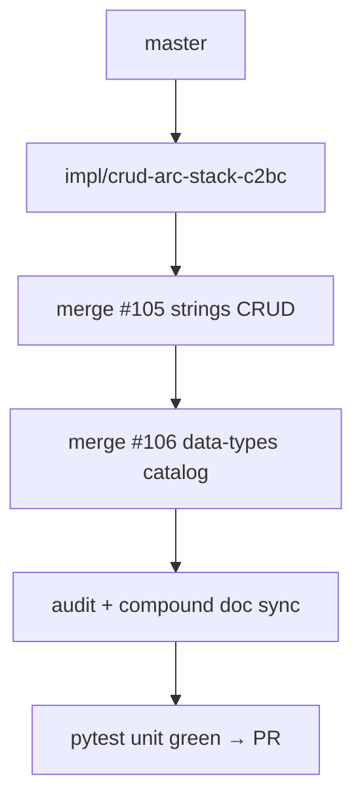

# LFG — CRUD arc stack

## Summary

Stack open PRs #105 (strings CRUD) and #106 (data-type catalog create/delete) into one integration branch for a single squash merge to `master`.



---

## Requirements

- R1. Branch includes commits from #105 and #106 with conflicts resolved
- R2. Audit reflects strings 4/4 and data-types catalog 3/4; CRUD score updated
- R3. Compound doc `agent-native-crud-arc.md` + solutions index
- R4. `uv run pytest -m unit -q --timeout=120` passes
- R5. Open PR superseding #105 and #106 for merge

---

## Conflict resolution policy

| File | Resolution |
|------|------------|
| `program_metadata.py` | Union `managestrings` + `managedatatypes` mutating actions |
| `tool_providers.py` | Union auto-checkin triggers |
| `docs/audits/2026-05-24-agent-native-audit.md` | Consolidated CRUD table |

---

## Verification

```bash
uv run pytest tests/test_manage_strings.py tests/test_manage_data_types.py -m unit -q --timeout=60
uv run pytest -m unit -q --timeout=120
```
