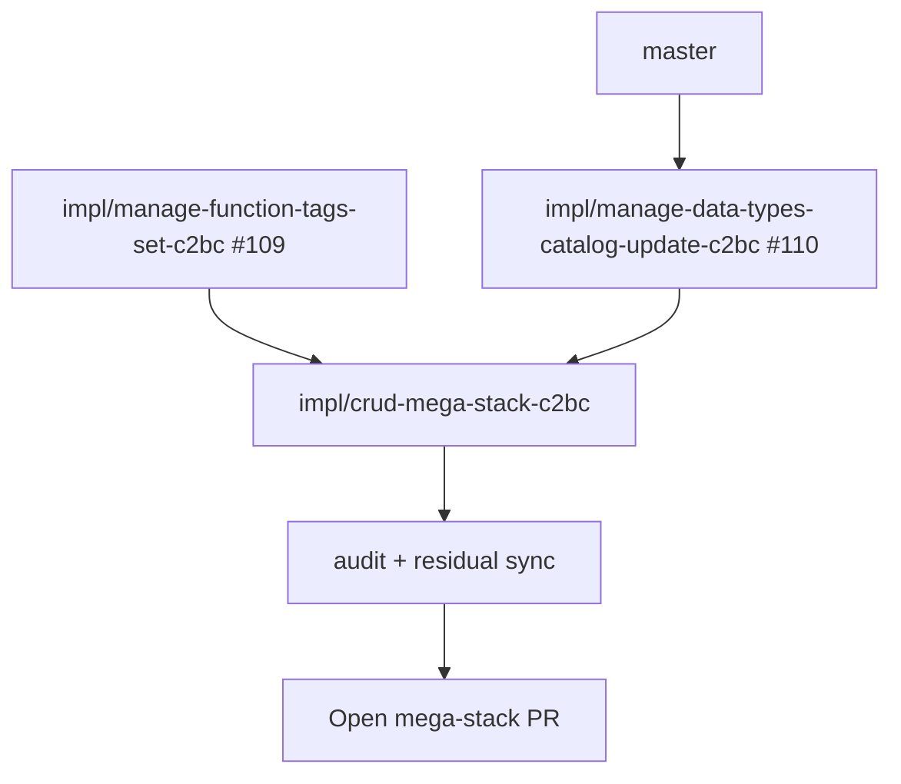

# LFG — CRUD mega-stack

## Summary

Stack open PRs **#110** (strings + catalog 4/4) and **#109** (function-tags set) into one integration branch for a single squash merge to `master`.



---

## Requirements

| ID | Requirement | Verification |
|----|-------------|--------------|
| R1 | Branch includes #110 + #109 commits with conflicts resolved | git log |
| R2 | Audit: strings 4/4, catalog 4/4, function tags 4/4; CRUD **11/12 (92%)** | `docs/audits/2026-05-24-agent-native-audit.md` |
| R3 | Residual tracker notes #110/#109 superseded by mega-stack PR | residual doc |
| R4 | `uv run pytest -m unit -q --timeout=120` passes | 254+ pass |
| R5 | Open PR superseding #107, #110, #109 | gh pr list |

---

## Conflict resolution policy

| File | Resolution |
|------|------------|
| `program_metadata.py` | Union `_MUTATING_TOOL_ACTIONS` for managedatatypes + managefunctiontags |
| `docs/audits/...` | Consolidated CRUD table |

---

## Verification

```bash
uv run pytest tests/test_manage_strings.py tests/test_manage_data_types.py tests/test_manage_function_tags.py -m unit -q --timeout=60
uv run pytest -m unit -q --timeout=120
```
