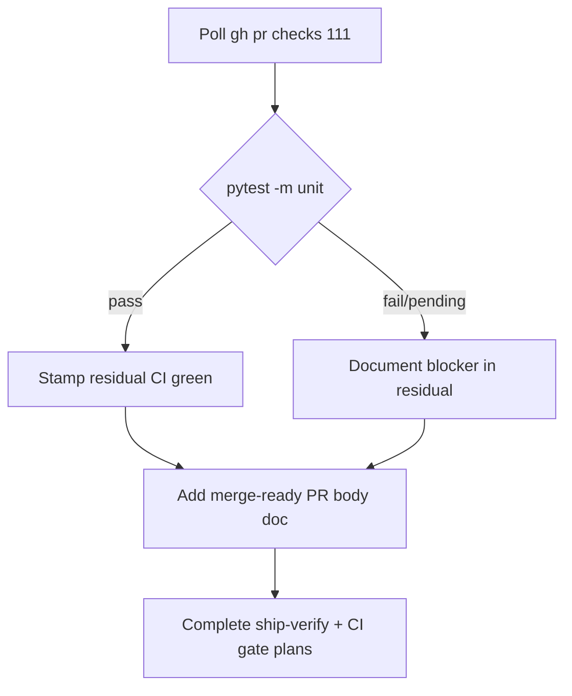

# LFG — CRUD mega-stack CI gate closeout (PR #111)

## Summary

Complete the open ship-verify gates for PR **#111**: confirm remote CI (`pytest -m unit`), record result in residual docs, publish a durable merge-ready PR body artifact (since `gh pr edit` is token-blocked), and mark the ship-verify plan lineage complete when ship-verify R6 is satisfied or explicitly documented.



---

## Requirements

- R1. Poll `gh pr checks 111` until `pytest -m unit` resolves (pass, fail, or documented pending/queued with run URL).
- R2. Update residual ship gate CI checkbox to match CI reality.
- R3. Add merge-ready PR body markdown under `docs/` for manual paste (R5 fallback when `gh pr edit` blocked).
- R4. Mark `docs/plans/2026-05-24-lfg-crud-mega-stack-ship-verify-c2bc.md` `status: completed` when R1–R3 done.
- R5. Re-run local `pytest -m unit` if branch HEAD changed; otherwise skip.

---

## Scope Boundaries

- **In scope:** CI polling, residual/docs updates, PR body artifact, plan status.
- **Out of scope:** Squash merge (human); closing superseded PRs; new feature code; post-merge closeout (awaits merge).

---

## Implementation Units

- U1. **Poll CI on PR #111**

**Goal:** Resolve `pytest -m unit` check status.

**Files:** none (CLI only)

**Verification:** `gh pr checks 111` shows `pytest -m unit` pass or failure URL recorded.

---

- U2. **Residual ship gate CI stamp**

**Goal:** Align residual checklist with CI outcome.

**Files:** `docs/residual-review-findings/impl-agent-native-audit-c2bc.md`

**Verification:** `[x] CI green on #111` when pass; failure URL noted when fail.

---

- U3. **Durable merge-ready PR body artifact**

**Goal:** Satisfy ship-verify R5 fallback — durable PR body without `gh pr edit`.

**Files:** Create `docs/pr-bodies/2026-05-29-pr111-crud-mega-stack-merge-ready.md`

**Verification:** File contains merge-ready summary, verification stamps, plan links, supersede note.

---

- U4. **Complete plan lineage**

**Goal:** Close ship-verify and this CI gate plan.

**Files:**
- Modify: `docs/plans/2026-05-24-lfg-crud-mega-stack-ship-verify-c2bc.md` → `status: completed`
- Modify: `docs/plans/2026-05-24-lfg-crud-mega-stack-ci-gate-c2bc.md` → `status: completed`

**Verification:** Both plans show `status: completed`; residual links PR body doc.

---

## Verification

```bash
gh pr checks 111
uv run pytest -m unit -q --timeout=120
```
