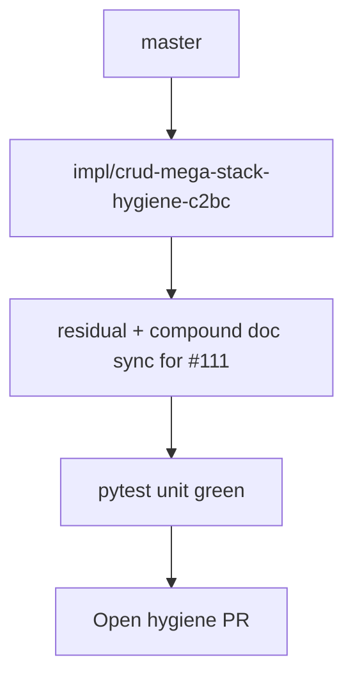

# LFG — CRUD mega-stack hygiene

## Summary

Document ship status for mega-stack PR **#111** on `master` — supersedes stale hygiene **#108** (#107 tracking). Mirrors discovery arc hygiene (#104).



---

## Requirements

| ID | Requirement | Verification |
|----|-------------|--------------|
| R1 | Residual doc lists #111 and superseded #105–#110 | `docs/residual-review-findings/impl-agent-native-audit-c2bc.md` |
| R2 | Compound doc on master notes open mega-stack (#111) | `docs/solutions/architecture-patterns/agent-native-crud-arc.md` |
| R3 | Solutions index references mega-stack | `docs/solutions/README.md` |
| R4 | Note #108 superseded by this hygiene PR | residual doc |
| R5 | `uv run pytest -m unit -q --timeout=120` on master | 237+ pass |

---

## Scope

- **In scope:** Docs on `master` only (audit score updates land with #111 merge).
- **Out of scope:** Merging #111; closing superseded PRs.

---

## Verification

```bash
uv run pytest -m unit -q --timeout=120
```
