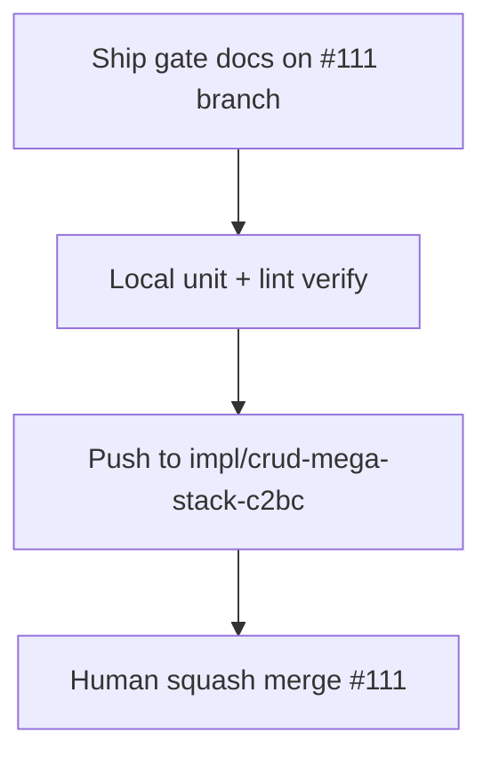

# LFG — CRUD mega-stack merge gate

## Summary

PR **#111** stacks full CRUD arc (12/12). Closeout: stamp ship gate with local verification, link PR #111 in residual/compound docs, push merge-ready state.



---

## Requirements

| ID | Requirement | Verification |
|----|-------------|--------------|
| R1 | Residual lists #111 URL + ship gate checklist with local stamps | residual doc |
| R2 | Compound doc canonical PR #111 | `agent-native-crud-arc.md` |
| R3 | `pytest -m unit` + ruff on CRUD paths green | 254 pass, ruff clean |
| R4 | Branch pushed; PR #111 updated | `gh pr view 111` |

---

## Scope

- **In scope:** Ship gate documentation, local verification.
- **Out of scope:** Squash merge (human gate); closing superseded PRs (token may lack permission).

---

## Verification

```bash
uv run pytest tests/test_manage_strings.py tests/test_manage_data_types.py tests/test_manage_function_tags.py -m unit -q --timeout=60
uv run pytest -m unit -q --timeout=120
uv run ruff check --no-fix src/agentdecompile_cli/mcp_server/providers/datatypes.py src/agentdecompile_cli/mcp_server/providers/strings.py src/agentdecompile_cli/mcp_server/providers/getfunction.py
```
