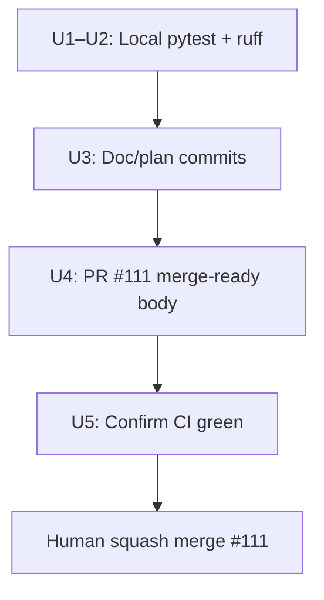

# LFG — CRUD mega-stack final ship verification (PR #111)

## Summary

PR **#111** implements the full CRUD arc (12/12) and is **MERGEABLE** on `master`. Implementation is complete; this plan covers **verification and documentation only** — re-run the unit + ruff gate, commit any pending doc stamps from the merge-gate closeout, and refresh PR #111 so a human can squash merge with confidence.

---

## Problem Frame

The merge-gate plan (`docs/plans/2026-05-24-lfg-crud-mega-stack-merge-gate-c2bc.md`) stamped local verification and linked PR #111 in residual/compound docs. One uncommitted local edit remains (merge-gate `status: completed`). Before human squash merge, we need a **fresh verification pass** and a **merge-ready PR surface** — no new feature work.

---

## Requirements

- R1. CRUD-focused unit tests pass (strings, data-types, function-tags).
- R2. Full unit suite passes at **254** baseline (no regressions).
- R3. `ruff check --no-fix` clean on CRUD provider paths.
- R4. Pending doc commits landed on `impl/crud-mega-stack-c2bc` (merge-gate plan status, any residual/compound cross-link gaps).
- R5. PR #111 body reflects merge-ready state (verification stamps, plan links, supersede note for #105–#110).
- R6. CI on #111 confirmed green (or blocker documented in residual ship gate).

---

## Scope Boundaries

- **In scope:** Local pytest + ruff, doc/plan status commits, PR #111 body refresh, residual ship-gate CI checkbox.
- **Out of scope:** New feature code or provider changes; squash merge (human gate); closing superseded PRs #105–#110 (token may lack permission); hygiene PR #112 (separate branch `impl/crud-mega-stack-hygiene-c2bc`).

### Deferred to Follow-Up Work

- Post-merge closeout (residual **Merged**, compound doc merge SHA): separate plan after #111 lands on `master`.
- PR #112 hygiene docs on master: optional parallel track; do not block #111 ship verify.

---

## Context & Research

### Relevant Code and Patterns

- CRUD providers: `src/agentdecompile_cli/mcp_server/providers/strings.py`, `datatypes.py`, `getfunction.py` (function-tags set mode).
- CRUD tests: `tests/test_manage_strings.py`, `tests/test_manage_data_types.py`, `tests/test_manage_function_tags.py`.
- Prior merge-gate verification recipe: `docs/plans/2026-05-24-lfg-crud-mega-stack-merge-gate-c2bc.md`.
- LFG ship-verify pattern: `docs/plans/2026-05-24-lfg-pr49-final-verify-c2bc.md`.

### Institutional Learnings

- Compound doc already canonical for #111: `docs/solutions/architecture-patterns/agent-native-crud-arc.md`.
- Residual ship gate checklist: `docs/residual-review-findings/impl-agent-native-audit-c2bc.md` (section **CRUD arc — mega-stack (PR #111)**). Local stamps present; CI and squash merge items still open.

### External References

- PR #111: https://github.com/bolabaden/AgentDecompile/pull/111 (OPEN, draft, MERGEABLE).
- Superseded: #105–#110; hygiene: #112 (supersedes #108).

---

## Key Technical Decisions

- **Verify-only scope:** No implementation units touch `src/` except running linters; all behavioral work is already on the branch.
- **254-test baseline:** Treat any count below 254 as a ship blocker; investigate before updating PR body.
- **Draft → ready:** Mark PR #111 ready for review only after local verify + doc commits are pushed (human may still squash from draft if preferred — body must still say merge-ready).

---

## High-Level Technical Design

> *This illustrates the intended approach and is directional guidance for review, not implementation specification.*



---

## Implementation Units

- U1. **CRUD-focused unit test verification**

**Goal:** Confirm strings, catalog, and function-tags CRUD tests pass in isolation.

**Requirements:** R1

**Dependencies:** None

**Files:**
- Test: `tests/test_manage_strings.py`
- Test: `tests/test_manage_data_types.py`
- Test: `tests/test_manage_function_tags.py`

**Approach:**
- Run CRUD test modules with `-m unit` and a bounded timeout.
- Expect **17** focused passes (per PR #111 body); record actual count in verification note if different.

**Test scenarios:**
- Happy path: all CRUD module tests pass with exit code 0.
- Error path: any failure blocks downstream units until root cause is documented (no code fixes in this plan unless regression is found — then escalate, do not silently expand scope).

**Verification:**
- CRUD trio pytest run exits 0.

---

- U2. **Full unit suite + ruff on CRUD paths**

**Goal:** Confirm no regressions across the unit suite and CRUD provider lint cleanliness.

**Requirements:** R2, R3

**Dependencies:** U1

**Files:**
- Test: full `tests/` tree with `-m unit`
- Lint: `src/agentdecompile_cli/mcp_server/providers/strings.py`
- Lint: `src/agentdecompile_cli/mcp_server/providers/datatypes.py`
- Lint: `src/agentdecompile_cli/mcp_server/providers/getfunction.py`

**Approach:**
- Full unit run must meet or exceed **254** passed.
- Ruff scoped to CRUD provider files (matches merge-gate recipe); do not `--fix` in verify-only pass.

**Test scenarios:**
- Happy path: ≥254 unit tests pass.
- Happy path: ruff reports zero errors on the three provider paths.
- Edge case: pre-existing repo-wide ruff violations outside CRUD paths are out of scope unless introduced by #111 diff.

**Verification:**
- Full unit suite green at 254+; ruff clean on CRUD providers.

---

- U3. **Doc and plan status commits**

**Goal:** Land pending documentation stamps and close the merge-gate plan lineage.

**Requirements:** R4

**Dependencies:** U2

**Files:**
- Modify: `docs/plans/2026-05-24-lfg-crud-mega-stack-merge-gate-c2bc.md` (uncommitted `status: completed`)
- Modify: `docs/plans/2026-05-24-lfg-crud-mega-stack-ship-verify-c2bc.md` (this plan — set `status: completed` when done)
- Review: `docs/residual-review-findings/impl-agent-native-audit-c2bc.md`
- Review: `docs/solutions/architecture-patterns/agent-native-crud-arc.md`

**Approach:**
- Commit merge-gate plan status if still unstaged.
- Scan residual/compound docs for missing #111 URL, ship-verify plan link, or stale open-PR wording; patch only gaps (compound doc already references #111).
- Add ship-verify verification date stamp to residual **Ship gate (PR #111)** section when local verify completes.
- Do not edit hygiene-only content destined for PR #112 unless a broken cross-link blocks #111 review.

**Test expectation:** none — documentation-only unit.

**Verification:**
- `git status` clean on doc paths after commit; merge-gate plan shows `status: completed`.

---

- U4. **PR #111 merge-ready body refresh**

**Goal:** PR description accurately reflects verification state and human merge instructions.

**Requirements:** R5

**Dependencies:** U3

**Files:**
- Modify: PR #111 body (via `gh pr edit 111`)

**Approach:**
- Preserve `<!-- CURSOR_AGENT_PR_BODY_BEGIN/END -->` wrapper if present.
- Ensure Summary, Audit impact table, Supersedes (#105–#110, #108 note), and Verification blocks match latest local run counts.
- Add link to this plan: `docs/plans/2026-05-24-lfg-crud-mega-stack-ship-verify-c2bc.md`.
- State **merge-ready** explicitly after U1–U2 pass; note draft status is cosmetic if human prefers squash from draft.
- Optional: `gh pr ready 111` if repository policy expects non-draft for merge.

**Test expectation:** none — GitHub metadata update.

**Verification:**
- `gh pr view 111` shows updated verification section and plan link; mergeable state unchanged.

---

- U5. **CI confirmation and residual checkbox**

**Goal:** Close the loop on remote CI before handoff to human squash merge.

**Requirements:** R6

**Dependencies:** U4 (push must precede CI re-run if new commits)

**Files:**
- Modify: `docs/residual-review-findings/impl-agent-native-audit-c2bc.md` (CI checkbox only)

**Approach:**
- Push branch after U3 commits.
- Run `gh pr checks 111` until required checks pass (notably `pytest -m unit`).
- Check `[x] CI green on #111` in residual ship gate when green; if blocked, document URL and failure in residual without claiming merge-ready falsely.

**Test scenarios:**
- Happy path: all required PR checks success.
- Error path: CI failure → record in residual, do not mark PR merge-ready in body.

**Verification:**
- Required CI green **or** explicit blocker documented; residual ship gate CI item matches reality.

---

## System-Wide Impact

- **Interaction graph:** None — verify/docs only; no MCP tool behavior changes.
- **Unchanged invariants:** All CRUD implementations on branch; master remains at discovery closeout (`1d8c1fb`) until human merge.

---

## Risks & Dependencies

| Risk | Mitigation |
|------|------------|
| Local pass count drifts from 254 | Record actual count; treat regression as ship blocker |
| CI pending/flaky on push | Poll `gh pr checks`; document blocker in residual |
| Uncommitted merge-gate edit lost | U3 explicitly commits before PR body refresh |
| Scope creep into feature fixes | Plan limits units to verify + docs; escalate regressions |

---

## Documentation / Operational Notes

- After human squash merge, run post-merge closeout (residual **Merged**, compound merge SHA) — not part of this plan.
- Hygiene PR #112 can land on master independently.

---

## Sources & References

- **Origin document:** [docs/plans/2026-05-24-lfg-crud-mega-stack-merge-gate-c2bc.md](docs/plans/2026-05-24-lfg-crud-mega-stack-merge-gate-c2bc.md)
- Implementation plan: [docs/plans/2026-05-24-lfg-crud-mega-stack-c2bc.md](docs/plans/2026-05-24-lfg-crud-mega-stack-c2bc.md)
- Compound: [docs/solutions/architecture-patterns/agent-native-crud-arc.md](docs/solutions/architecture-patterns/agent-native-crud-arc.md)
- Residual: [docs/residual-review-findings/impl-agent-native-audit-c2bc.md](docs/residual-review-findings/impl-agent-native-audit-c2bc.md)
- PR #111, hygiene PR #112

---

## Verification (reference)

```bash
uv run pytest tests/test_manage_strings.py tests/test_manage_data_types.py tests/test_manage_function_tags.py -m unit -q --timeout=60
uv run pytest -m unit -q --timeout=120
uv run ruff check --no-fix src/agentdecompile_cli/mcp_server/providers/datatypes.py src/agentdecompile_cli/mcp_server/providers/strings.py src/agentdecompile_cli/mcp_server/providers/getfunction.py
gh pr checks 111
```
