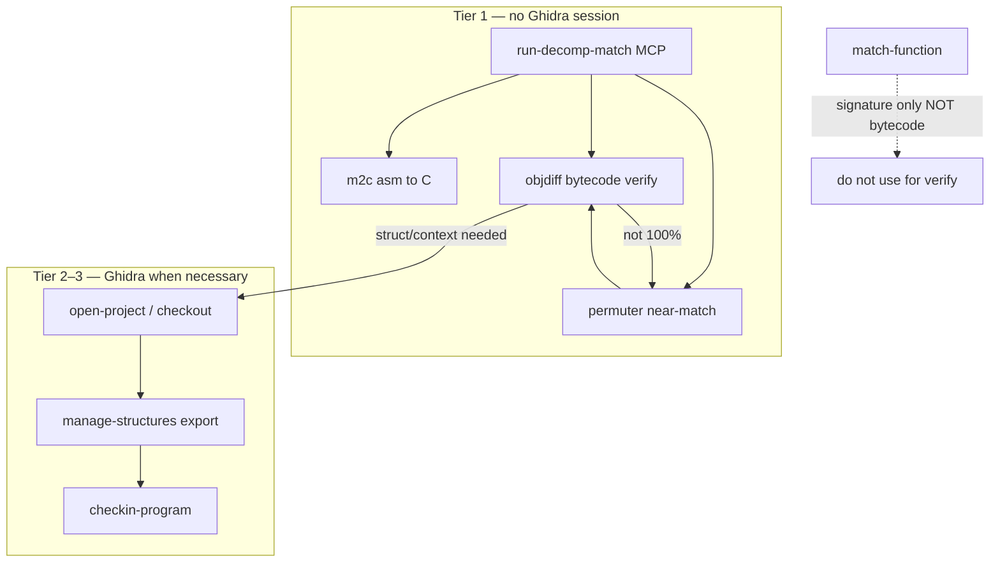

# LFG — Tier 1 decomp matching toolchain

## Objective

Implement the decompilation matching workflow from [zeldaret/tww decompiling.md](https://github.com/zeldaret/tww/blob/main/docs/decompiling.md) as **Tier 1 MCP tools** so agents verify **bytecode/object matches** via objdiff without Ghidra JVM startup. Ghidra MCP (Tier 2–3) remains required for **shared/versioned** projects: checkout, struct export, mutations, check-in.



## Requirements

| ID | Requirement | Status |
|----|-------------|--------|
| R1 | `Tool.RUN_DECOMP_MATCH`; `analysis_tier` = 1 | done |
| R2 | `DecompMatchToolProvider` — no `_require_program()` | done |
| R3 | Wrap **m2c**, **objdiff-cli** (report + diff), **permuter** via subprocess | done |
| R4 | Parse objdiff report JSON for `matched_percent` / per-function fuzzy % | done |
| R5 | Response `routing`: objdiff = bytecode match; `match-function` ≠ bytecode | done |
| R6 | Shared-project note: Ghidra for checkout/struct/check-in only | done |
| R7 | Unit tests `tests/test_run_decomp_match.py`; tier/capabilities parity | done |
| R8 | Tiered RE skill + KB updated | done |
| R9 | `TOOLS_LIST.md` canonical entry for `run-decomp-match` | done |
| R10 | Compound doc `docs/solutions/architecture-patterns/decomp-matching-toolchain.md` | done |
| R11 | Discovery counts README/capabilities (67 canonical / 63 advertised) | done |
| R12 | `uv run pytest -m unit` green | done |

## Scope boundaries

**In scope:** MCP facade, routing metadata, docs, tests.

**Out of scope:** Installing m2c/objdiff/permuter on CI runners; Ghidra asm-export bridge (future Tier 2); objdiff.json generator; benchmarks.

## Implementation units

### U1 — Core MCP tool (complete)

- `src/agentdecompile_cli/mcp_utils/decomp_match.py`
- `src/agentdecompile_cli/mcp_server/providers/decomp_match.py`
- `src/agentdecompile_cli/registry.py`

### U2 — Documentation closeout

- `TOOLS_LIST.md` — `run-decomp-match` spec
- `docs/solutions/architecture-patterns/decomp-matching-toolchain.md` — workflow + shared vs local routing
- `README.md` — tool counts
- `docs/solutions/architecture-patterns/tier01-mcp-discovery-sync.md` — count bump if referenced

### U3 — Verification

```bash
uv run pytest tests/test_run_decomp_match.py tests/test_tool_analysis_tier.py tests/test_capabilities_resource.py -m unit -v
uv run pytest -m unit -q --timeout=120
uv run ruff check --no-fix src/agentdecompile_cli/mcp_utils/decomp_match.py src/agentdecompile_cli/mcp_server/providers/decomp_match.py
```

## Test scenarios

| Scenario | Expected |
|----------|----------|
| m2c with assemblyPath | decompiledC in payload |
| objdiff report JSON | summary.overallMatchPercent, nonmatching functions |
| objdiff 100% | suggestedTierEscalation tier 1 |
| objdiff &lt;100% | tier 2 escalation mentions permuter/m2c |
| permuterDir missing | ValueError |
| bundle all without paths | skips with structured skipped reason |
| match-function not advertised as bytecode tool | routing.notBytecodeMatch |

## Deferred to implementation

- Live integration test when objdiff-cli installed on agent host
