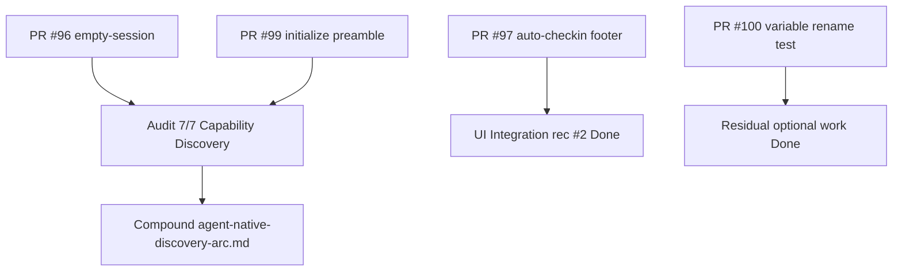

# LFG — Discovery arc audit sync (PRs #96–#100)

## Summary

Four open impl PRs close agent-native discovery and UI-integration gaps. Sync `docs/audits/2026-05-24-agent-native-audit.md` and residual tracker to the post-merge target state, and compound the arc in solutions docs.



---

## Requirements

| ID | Requirement |
|----|-------------|
| R1 | Audit: Capability Discovery **7/7** with empty-state + initialize preamble marked Done (PR #96, #99) |
| R2 | Audit: UI Integration rec #2 auto-checkin footer Done (PR #97) |
| R3 | Audit: Context Injection rec #4 Done (capabilities + initialize preamble) |
| R4 | Audit summary table and overall score updated (~76%) |
| R5 | Add `docs/solutions/architecture-patterns/agent-native-discovery-arc.md` |
| R6 | Link from `docs/solutions/README.md`; residual tracker discovery arc section |
| R7 | `uv run pytest -m unit -q --timeout=120` passes on master |

---

## Scope Boundaries

- No merge of PRs #96–#100 in this slice (audit/docs only)
- No handler or test code changes

---

## Implementation Units

- U1. Audit sync — R1–R4
- U2. Compound doc + cross-links — R5, R6
- U3. Verification — R7

---

## Verification

```bash
uv run pytest -m unit -q --timeout=120
```
