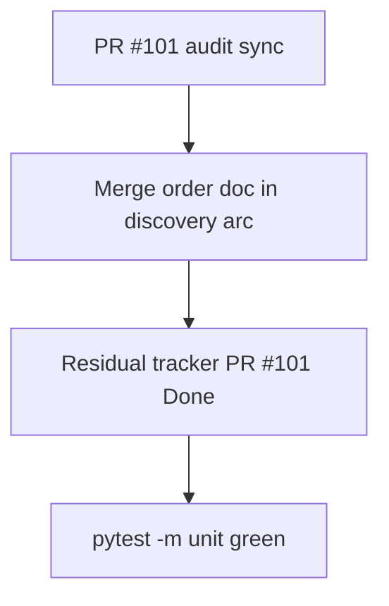

# LFG — Discovery arc audit sync closeout

## Summary

PR #101 syncs the agent-native audit to the post-merge discovery arc state. Closeout adds merge-order guidance, updates compound doc with PR #101, and finalizes residual tracker.



---

## Requirements

| ID | Requirement |
|----|-------------|
| R1 | `agent-native-discovery-arc.md` includes PR #101 audit sync + recommended merge order |
| R2 | Residual tracker lists PR #101 and merge sequence |
| R3 | Audit doc references PR #101 for audit sync |
| R4 | `uv run pytest -m unit -q --timeout=120` passes |

---

## Implementation Units

- U1. Compound doc + audit cross-link — R1, R3
- U2. Residual tracker merge gate — R2

---

## Verification

```bash
uv run pytest -m unit -q --timeout=120
```
