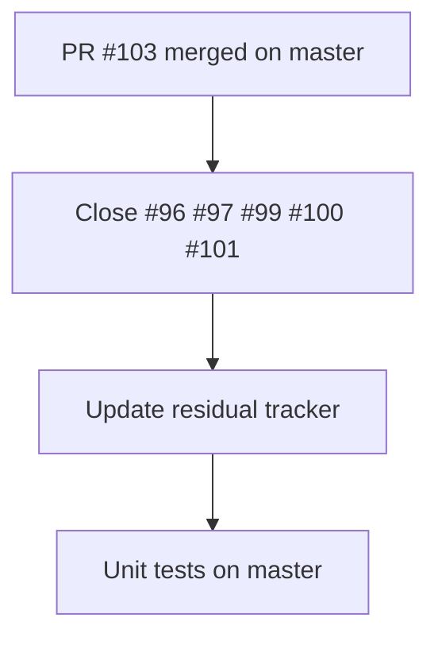

# LFG — Discovery arc hygiene

## Summary

PR #102 merged the discovery arc to `master` (`d3c0c4e`); PR #103 landed merge closeout docs (`1d8c1fb`). Close superseded open PRs #96–#101, update residual tracker, and verify unit tests on `master`.

---

## Problem Frame

Five slice PRs (#96–#101) remain open after stack merge #102. Hygiene closes them with superseded-by-#102 comments and records completion in residual docs.

---

## Requirements

- R1. Close PRs #96, #97, #99, #100, #101 with superseded-by-#102 comment *(blocked: cloud agent `gh` token lacks `closePullRequest`; documented in residual)*
- R2. Update `docs/residual-review-findings/impl-agent-native-audit-c2bc.md` to mark PRs closed
- R3. `uv run pytest -m unit -q --timeout=120` passes on `master`

---

## Scope Boundaries

- Do not merge or modify code from superseded PR branches
- Do not address unrelated open PRs (#98, #29, #9)

---

## Implementation Units

- U1. **Close superseded PRs**

**Goal:** Remove stale open PRs from the discovery arc slice branches.

**Requirements:** R1

**Dependencies:** None

**Files:**
- Modify: none (GitHub PR state only)

**Approach:**
- `gh pr close` each of #96, #97, #99, #100, #101 with comment "Superseded by #102 (discovery arc stack merge to master)."

**Test scenarios:**
- Test expectation: none — GitHub API hygiene

**Verification:**
- `gh pr list --state open` no longer shows #96–#101

---

- U2. **Update residual tracker**

**Goal:** Record that superseded PRs are closed.

**Requirements:** R2

**Dependencies:** U1

**Files:**
- Modify: `docs/residual-review-findings/impl-agent-native-audit-c2bc.md`

**Approach:**
- Change "close when convenient" to "closed (superseded by #102)" with date

**Test scenarios:**
- Test expectation: none — documentation

**Verification:**
- Residual doc reflects closed state for #96–#101

---

- U3. **Verify master tests**

**Goal:** Confirm master is green after discovery arc merge.

**Requirements:** R3

**Dependencies:** None

**Files:**
- Test: existing unit test suite

**Approach:**
- Run `uv run pytest -m unit -q --timeout=120` on `master` branch

**Test scenarios:**
- Happy path: all unit tests pass

**Verification:**
- pytest exit code 0

---

## Sources & References

- **Origin document:** docs/plans/2026-05-24-lfg-discovery-arc-merge-gate-c2bc.md
- Stack merge: PR #102 (`d3c0c4e`)
- Closeout merge: PR #103 (`1d8c1fb`)
- Residual: docs/residual-review-findings/impl-agent-native-audit-c2bc.md
