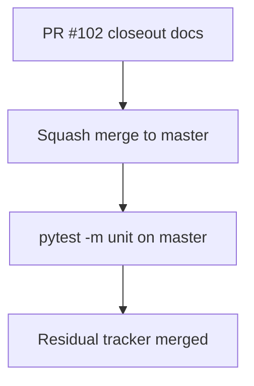

# LFG — Discovery arc stack merge gate

## Summary

PR #102 stacks the full discovery arc (#96–#101). Closeout updates compound docs with PR #102, attempts squash merge to `master`, and verifies unit tests post-merge.



---

## Requirements

| ID | Requirement |
|----|-------------|
| R1 | `agent-native-discovery-arc.md` references PR #102 as canonical merge path |
| R2 | Residual tracker marks discovery arc **Merged** after #102 lands |
| R3 | Squash merge PR #102 to `master` (or document blocker) |
| R4 | `uv run pytest -m unit -q --timeout=120` passes on post-merge `master` |

---

## Verification

```bash
uv run pytest -m unit -q --timeout=120
```
