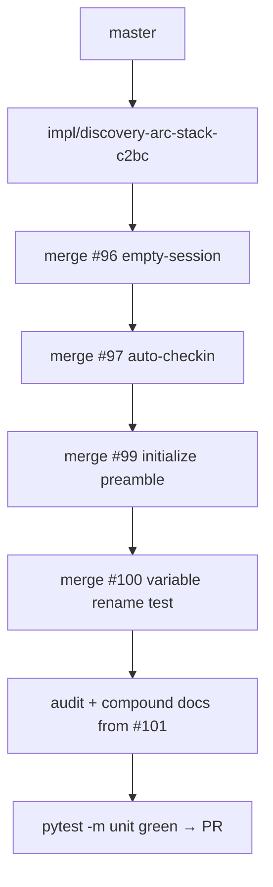

# LFG — Discovery arc stack branch

## Summary

Five open PRs (#96–#101) implement the discovery arc but remain unmerged. Create one integration branch stacking all feature code plus consolidated audit/docs so a single squash merge lands the arc on `master`.



---

## Requirements

| ID | Requirement |
|----|-------------|
| R1 | Branch merges #96, #97, #99, #100 with conflicts resolved |
| R2 | Audit, residual tracker, and compound docs match post-merge target (#101) |
| R3 | `uv run pytest -m unit -q --timeout=120` passes |
| R4 | Open PR targeting `master`; note it supersedes #96–#101 for merge |

---

## Conflict resolution policy

| File | Resolution |
|------|------------|
| `docs/audits/2026-05-24-agent-native-audit.md` | Use #101 consolidated version (7/7 Capability Discovery) |
| `docs/residual-review-findings/impl-agent-native-audit-c2bc.md` | Use #101 arc table |
| `docs/solutions/README.md` | Union all architecture-patterns entries |
| `response_formatter.py` | Keep both empty-session + auto-checkin footer |
| `program_metadata.py` | Keep auto-checkin helpers |
| `tool_providers.py` | Keep auto-checkin merge |
| `tool_reference.py` | Keep `build_initialize_instructions` |
| `server.py` / `bridge.py` | Keep instructions wiring |

---

## Verification

```bash
uv run pytest tests/test_empty_session_hints.py tests/test_auto_checkin_footer.py tests/test_initialize_instructions.py tests/test_variable_rename_integration.py -m unit -q --timeout=60
uv run pytest -m unit -q --timeout=120
```
