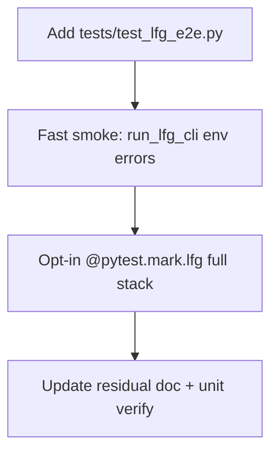

# LFG — `test_lfg_e2e.py` pytest shim

## Objective

Close the P3 gap where `scripts/lfg_validation.py` documents `pytest tests/test_lfg_e2e.py -m lfg` but the module does not exist. Add a **collection-safe** pytest module with fast env checks and an opt-in full-stack test gated by `LFG_RUN=1`.

## Flow



## Requirements

| ID | Requirement | Verification |
|----|-------------|--------------|
| R1 | `tests/test_lfg_e2e.py` exists and imports `run_lfg_cli` from `scripts/lfg_validation.py` | `uv run pytest tests/test_lfg_e2e.py -m "not lfg" -q` |
| R2 | Full stack test marked `lfg`, skipped unless `LFG_RUN=1` | Default CI/unit runs exclude `-m lfg` |
| R3 | Residual doc references PR #45 merged and new test module | `docs/residual-review-findings/impl-blocking-analysis-gate-c2bc.md` |
| R4 | Unit suite still green | `uv run pytest -m unit -q --timeout=120` |

## Scope boundaries

- **In scope:** Pytest module, residual doc, branch push + PR.
- **Out of scope:** Running full `lfg_validation.py` in cloud CI (no Ghidra Server creds); merging conflicting PR #43 (superseded on master).

## Implementation units

### IU1 — `tests/test_lfg_e2e.py`

- Load `scripts/lfg_validation.py` via `importlib`.
- Fast tests (no `lfg` marker): missing `GHIDRA_INSTALL_DIR` → exit 2; invalid phase range → exit 2.
- `@pytest.mark.lfg` test: call `run_lfg_cli` with `--manage-mcp`, `--skip-pytest`, `--from-phase 9 --to-phase 9` only when `LFG_RUN=1` — **or** document skip and delegate full run to explicit env (prefer skip + smoke only in CI).

**Decision:** Full-stack test uses `LFG_RUN=1` and runs phases 1–9 only when set; default collection runs fast smoke only.

### IU2 — Residual findings update

- Note PR #44 + #45 merged; `test_lfg_e2e.py` present; canonical driver still `scripts/lfg_validation.py`.

## Test scenarios (IU1)

| Scenario | Expected |
|----------|----------|
| `run_lfg_cli([])` without Ghidra env | return code `2` |
| `run_lfg_cli` with `--from-phase 10` | return code `2` |
| `pytest -m lfg` without `LFG_RUN` | full test skipped |
| `pytest -m unit` | unchanged pass count |

## Verification

```bash
uv run pytest tests/test_lfg_e2e.py -m "not lfg" -q --timeout=60
uv run pytest -m unit -q --timeout=120
```
