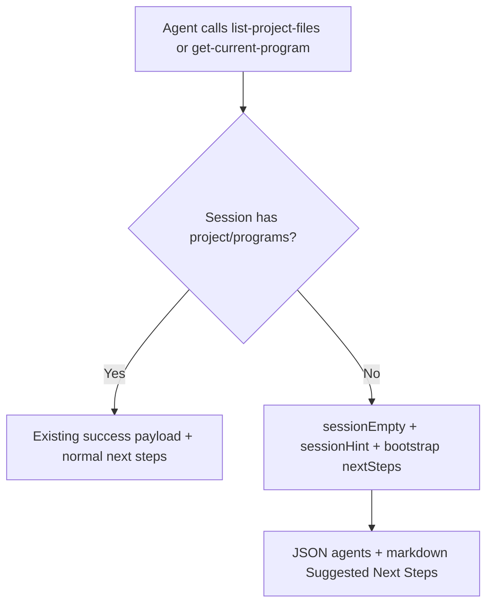

# LFG — Proactive empty-session hints on project discovery tools

## Summary

When agents call `get-current-program` or `list-project-files` on a fresh MCP session with no project or programs loaded, return **proactive bootstrap guidance** (`sessionEmpty`, `sessionHint`, `nextSteps`) in success JSON and markdown — not only reactive errors from other tools.



---

## Problem Frame

The agent-native audit Capability Discovery score is 5/7; **Empty state** is ⚠️ reactive errors only. Agents probing session state get empty lists or `loaded: false` without bootstrap instructions until a mutating tool fails.

---

## Requirements

| ID | Requirement |
|----|-------------|
| R1 | Empty-session success responses include `sessionEmpty: true`, `sessionHint`, and `nextSteps` bootstrap list |
| R2 | Applies to `list-project-files` when no project/programs (count 0, "No project loaded") |
| R3 | Applies to `get-current-program` when `loaded: false` and no available programs |
| R4 | `_next_steps_project` in `response_formatter.py` emits same hints for markdown |
| R5 | Unit tests for helper, formatter, and handler payloads |
| R6 | Audit recommendation #3 marked addressed |

---

## Scope Boundaries

- No initialize preamble or new MCP tools
- No changes to error-only paths (already have ActionableError nextSteps)
- Shared-server empty repo keeps existing note; add bootstrap only when truly no session

---

## Key Technical Decisions

- Centralize hint text in `response_formatter.py` (`enrich_empty_session_payload`) — single source for JSON + markdown
- Handlers call enrich helper before `create_success_response`; set `action: "list"` on list responses for formatter routing
- Do not inject nextSteps globally for all tools (minimal blast radius)

---

## Implementation Units

- U1. **Empty-session helpers** — `response_formatter.py`: `_empty_session_bootstrap_steps`, `_payload_indicates_empty_session`, `enrich_empty_session_payload`, extend `_next_steps_project`
- U2. **Handler wiring** — `project.py`: `_handle_list` and `_handle_get_current_program` empty paths call enrich
- U3. **Tests** — `tests/test_empty_session_hints.py`
- U4. **Audit sync** — `docs/audits/2026-05-24-agent-native-audit.md` mark recommendation #3 Done

---

## Verification

```bash
uv run pytest tests/test_empty_session_hints.py -m unit -q --timeout=60
uv run pytest -m unit -q --timeout=120
```
