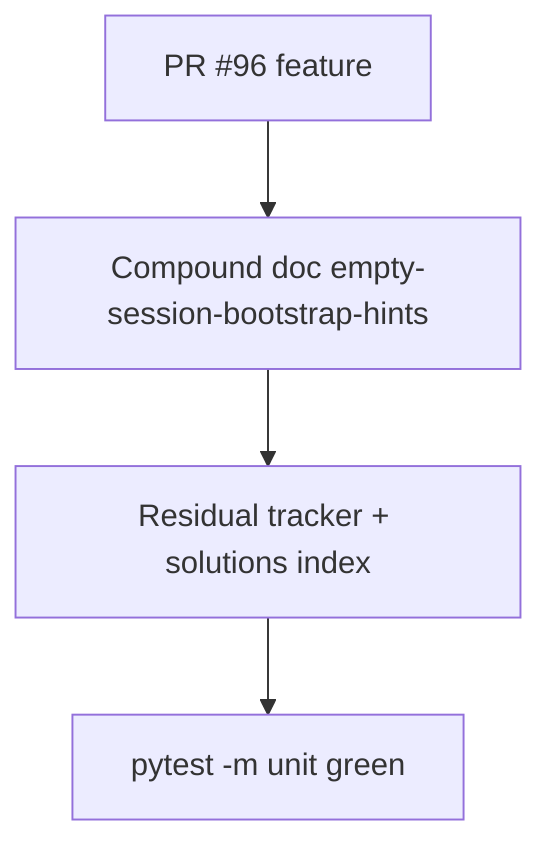

# LFG — Empty-session hints closeout + compound doc

## Summary

PR #96 ships proactive empty-session bootstrap hints. This closeout compounds the learning, syncs residual tracker, and cross-links agent-native pattern docs.



---

## Requirements

| ID | Requirement |
|----|-------------|
| R1 | Add `docs/solutions/architecture-patterns/empty-session-bootstrap-hints.md` |
| R2 | Link from `docs/solutions/README.md` and `agent-native-mcp-patterns.md` |
| R3 | Residual tracker: proactive empty-session hints **Done** (PR #96) |
| R4 | Mark feature plan `status: completed` |
| R5 | `uv run pytest tests/test_empty_session_hints.py -m unit -q` passes |

---

## Implementation Units

- U1. Compound doc — R1
- U2. Cross-links — R2
- U3. Residual + plan stamp — R3, R4

---

## Verification

```bash
uv run pytest tests/test_empty_session_hints.py -m unit -q --timeout=60
uv run pytest -m unit -q --timeout=120
```
