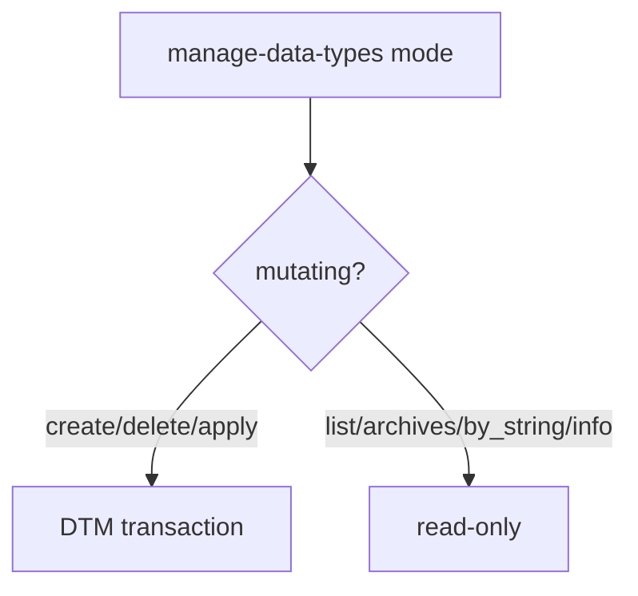

# LFG — manage-data-types catalog create/delete

## Summary

Close the agent-native audit **data-type catalog create** gap by adding `create` and `delete` modes to `manage-data-types`, plus `info` for search-everything parity.

---

## Problem Frame

`manage-data-types` can list/parse/apply types but cannot add or remove catalog entries in the program DataTypeManager.

---

## Requirements

- R1. Add `create` mode: parse `dataTypeString`, optional `name` typedef alias, `categoryPath`, conflict flow
- R2. Add `delete` mode: remove catalog type by `name` (+ optional `categoryPath`)
- R3. Add `info` mode: resolve type metadata (fixes search-everything `mode=info` suggestion)
- R4. UI hints / auto-checkin only on mutating modes (`create`, `delete`, `apply`)
- R5. Unit tests in `tests/test_manage_data_types.py`

---

## Scope Boundaries

- Struct/union catalog CRUD stays on `manage-structures`; enums on `manage-enums`
- Generic catalog update/edit deferred (audit allows partial update)

---

## Implementation Units

- U1. **Catalog CRUD handlers** — `datatypes.py`, `registry.py`, `program_metadata.py`, `tool_providers.py`
- U2. **Tests** — `tests/test_manage_data_types.py`
- U3. **Audit sync** — update CRUD table in audit doc

---

## Sources & References

- `src/agentdecompile_cli/mcp_server/providers/enums.py` (create/delete pattern)
- `src/agentdecompile_cli/mcp_server/providers/datatypes.py`
