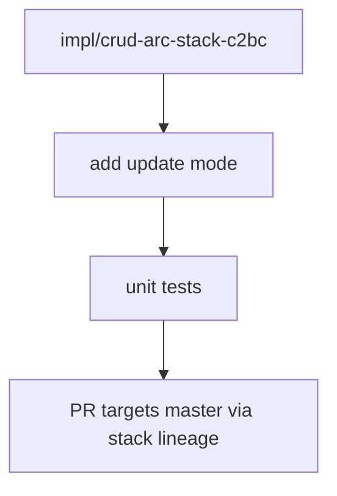

# LFG — manage-data-types catalog update mode

## Summary

Close the **data-type catalog 3/4 → 4/4** CRUD gap by adding `update` mode to `manage-data-types`. Builds on CRUD stack branch (`impl/crud-arc-stack-c2bc`, PR #107).



---

## Requirements

| ID | Requirement | Verification |
|----|-------------|--------------|
| R1 | `mode=update` modifies catalog typedef by `name` | Handler + integration test |
| R2 | Supports `description`, `dataTypeString` (new base), `newName` (rename) — at least one required | Arg validation |
| R3 | Schema enum includes `update`; mutating action gate | `list_tools`, `program_metadata` |
| R4 | Conflict flow when `newName` collides with existing entry | Optional conflict like create |
| R5 | Unit tests in `tests/test_manage_data_types.py` | pytest -m unit |
| R6 | Full unit suite green | 254+ pass |

---

## Files

- `src/agentdecompile_cli/mcp_server/providers/datatypes.py`
- `src/agentdecompile_cli/mcp_server/program_metadata.py`
- `src/agentdecompile_cli/registry.py` (optional alias `update-data-type`)
- `tests/test_manage_data_types.py`

---

## Out of scope

- Merging #107; mega-stack with #109

---

## Verification

```bash
uv run pytest tests/test_manage_data_types.py -m unit -q --timeout=60
uv run pytest -m unit -q --timeout=120
```
