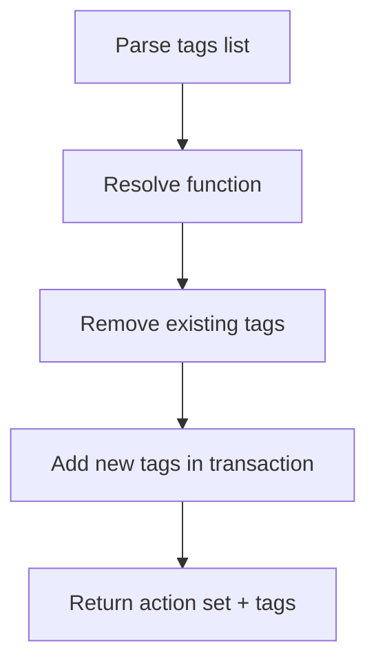

# LFG — manage-function-tags set mode

## Summary

Close the **function tags 3/4 → 4/4** CRUD gap by implementing a real `set` mode that replaces a function's tag list (not alias of `add`). Audit lists function-tag **update partial**; `_AUTO_MATCH_TRIGGER_MODES` already lists `set` as mutating but handler treated `set` like `add`.



---

## Requirements

| ID | Requirement | Verification |
|----|-------------|--------------|
| R1 | `mode=set` replaces all tags on a function | Integration/unit behavior |
| R2 | Accept `tags` as comma-separated string or list; single `tag` still works for one-tag set | Handler arg parsing |
| R3 | Schema enum includes `set`; `set` distinct from `add` | `list_tools` schema |
| R4 | Response `action` is `set` for set mode | JSON payload |
| R5 | Unit tests for schema, mutating action gate, tag list parsing | `tests/test_manage_function_tags.py` |
| R6 | `uv run pytest -m unit -q --timeout=120` passes | CI |

---

## Files

- `src/agentdecompile_cli/mcp_server/providers/getfunction.py` — `_handle_tags` set branch
- `src/agentdecompile_cli/mcp_server/program_metadata.py` — `_MUTATING_TOOL_ACTIONS` for `managefunctiontags` if missing
- `tests/test_manage_function_tags.py` — new unit tests

---

## Out of scope

- Global tag rename via `FunctionTagManager` (future slice)
- Data-type catalog update (lands on CRUD stack #107 follow-up)

---

## Verification

```bash
uv run pytest tests/test_manage_function_tags.py -m unit -q --timeout=60
uv run pytest -m unit -q --timeout=120
```
