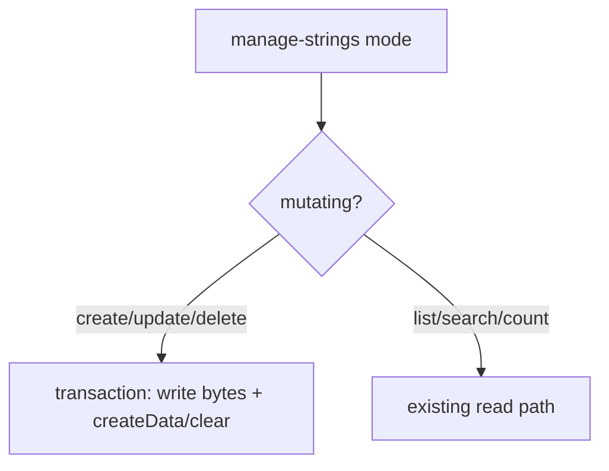

# LFG — manage-strings CRUD

## Summary

Close the agent-native audit strings CRUD gap (1/4 → 4/4) by adding `create`, `update`, and `delete` modes to `manage-strings`, with unit tests and UI-hint wiring for mutating modes only.

---

## Problem Frame

`manage-strings` is read-only today despite registry classifying it as state-writing. Audit scores strings at 1/4 CRUD.

---

## Requirements

- R1. Add `create`, `update`, `delete` modes to `manage-strings` MCP schema and dispatch
- R2. `create`/`update` write encoded bytes at `addressOrSymbol` and define Ghidra string data (`string` or `unicode`)
- R3. `delete` clears string data definition at `addressOrSymbol`
- R4. Mutating responses include `action` field; UI hints/auto-checkin only on mutating modes
- R5. Unit tests in `tests/test_manage_strings.py`; integration test when Ghidra available

---

## Scope Boundaries

- ASCII (`string`) and UTF-16 (`unicode`) encodings only
- No batch string CRUD in this slice
- Data-type catalog create remains a separate gap

---

## Implementation Units

- U1. **String mutation helpers and handlers**

**Goal:** Implement create/update/delete in `StringToolProvider`.

**Requirements:** R1, R2, R3

**Files:**
- Modify: `src/agentdecompile_cli/mcp_server/providers/strings.py`
- Modify: `src/agentdecompile_cli/registry.py` (TOOL_PARAMS)
- Modify: `src/agentdecompile_cli/mcp_server/program_metadata.py` (mutating actions)

**Approach:** Route mutating modes before read collection; use `_run_program_transaction`, `memory.setBytes`, `listing.clearCodeUnits` + `createData` via DataTypeParser.

**Test scenarios:**
- Happy path: schema lists create/update/delete
- Error path: create without addressOrSymbol raises
- Edge case: encode utf16 adds null terminator pairs

**Verification:** Handlers return success payload with address, value, encoding, action

---

- U2. **Unit and integration tests**

**Goal:** Test coverage for schema, helpers, and optional Ghidra persistence.

**Requirements:** R5

**Files:**
- Create: `tests/test_manage_strings.py`

**Test scenarios:**
- Happy path: mode enum includes mutating modes
- Happy path: encode_program_string ascii/utf16
- Integration: create string at address, list finds it (skip without Ghidra)

**Verification:** `uv run pytest tests/test_manage_strings.py -v`

---

- U3. **Audit doc sync**

**Goal:** Update CRUD table for strings.

**Requirements:** R1

**Files:**
- Modify: `docs/audits/2026-05-24-agent-native-audit.md`

**Test expectation:** none — documentation

**Verification:** Strings row shows 4/4 CRUD

---

## Sources & References

- Audit: `docs/audits/2026-05-24-agent-native-audit.md`
- Pattern: `src/agentdecompile_cli/mcp_server/providers/data.py` (`apply-data-type`)
- Pattern: `tests/test_manage_enums.py`
