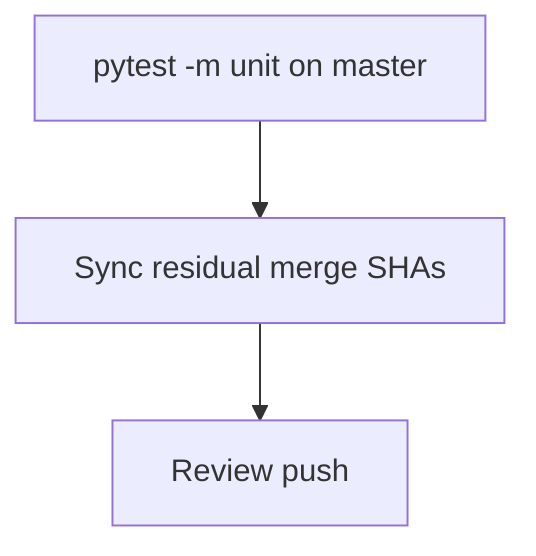

# LFG — master arc verification (post PR #51)

## Summary

Agent-native audit arc is merged to `master` (PR #49–#51). Verify unit tests on current `master` and sync residual tracker with final merge SHA `adaa472`.

---

## Flow



---

## Requirements

- R1. Residual doc lists PR #49, #50, and #51 merge SHAs on `master`.
- R2. `pytest -m unit` passes on `master` (124+ tests).
- R3. Plan marked completed; **Residual actionable work: none**.

---

## Scope Boundaries

- **In scope:** Doc sync, verification only.
- **Out of scope:** New features; live Ghidra `/lfg` driver (requires server creds).

---

## Implementation Units

- U1. Update `docs/residual-review-findings/impl-agent-native-audit-c2bc.md` merge traceability.
- U2. Run unit tests on `master`.

## Verification

```bash
uv run pytest -m unit -q --timeout=120
```
