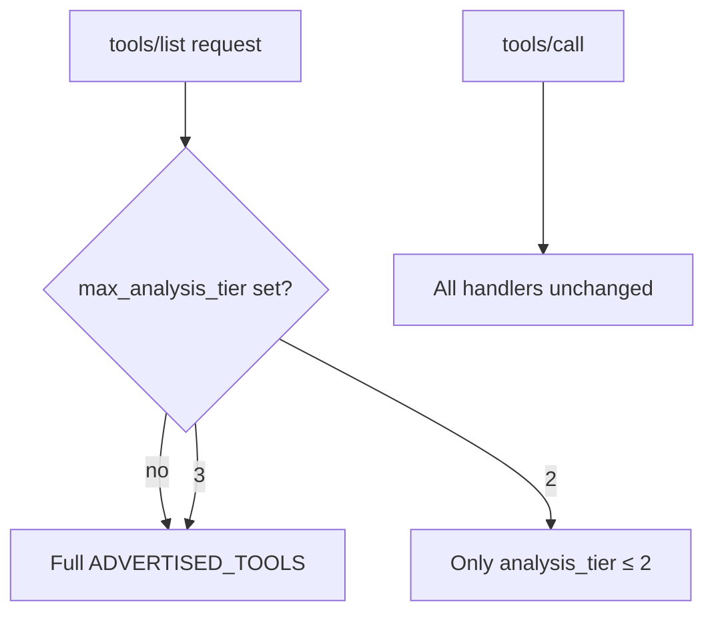

# LFG — runtime tools/list filter by max analysis_tier

## Objective

Let agents constrain `tools/list` to Tier 2 (read-only) or lower before escalating to Tier 3 mutate tools. Closes KB future item "Optional runtime filter on tools/list by max tier".



## Requirements

| ID | Requirement |
|----|-------------|
| R1 | Env `AGENTDECOMPILE_MAX_ANALYSIS_TIER` (alias `AGENT_DECOMPILE_MAX_ANALYSIS_TIER`) — values `2` or `3`; unset = no filter |
| R2 | HTTP header `X-AgentDecompile-Max-Analysis-Tier` per-request override (same values) |
| R3 | `get_advertised_tools_for_list()` filters `ADVERTISED_TOOLS` by tier; used in `ToolProviderManager.list_tools()` |
| R4 | `tools/call` unchanged — hidden tier-3 tools still callable (curated-surface parity) |
| R5 | `agentdecompile://capabilities` summary includes `max_analysis_tier` when active; tools list filtered |
| R6 | Proxy forwards header; unit tests in `tests/test_max_analysis_tier_filter.py` |

## Out of scope

- Tier 0–1 as MCP tools (shell/ghidrecomp remain docs-only)
- Dependabot #61

## Files

| File | Change |
|------|--------|
| `src/agentdecompile_cli/registry.py` | Parse env, filter helper, `get_advertised_tools_for_list()` |
| `src/agentdecompile_cli/mcp_server/session_context.py` | Context var + getter |
| `src/agentdecompile_cli/mcp_server/server.py` | Parse header, set context |
| `src/agentdecompile_cli/mcp_server/tool_providers.py` | Use filtered list in `list_tools()` |
| `src/agentdecompile_cli/mcp_utils/tool_reference.py` | Capabilities payload reflects filter |
| `src/agentdecompile_cli/mcp_server/proxy_server.py` | Forward header |
| `tests/test_max_analysis_tier_filter.py` | Unit tests |

## Test scenarios

- T1: `MAX_ANALYSIS_TIER=2` excludes `decompile-function`, keeps `list-functions`
- T2: Header override `3` with env `2` → tier 3 tools listed
- T3: Invalid tier ignored (no filter)
- T4: `tools/call` still dispatches tier-3 tool when filtered from list

## Verification

```bash
uv run pytest tests/test_max_analysis_tier_filter.py -m unit -v
uv run pytest -m unit -q --timeout=120
uv run ruff check --no-fix src/agentdecompile_cli/registry.py src/agentdecompile_cli/mcp_server/tool_providers.py
```
