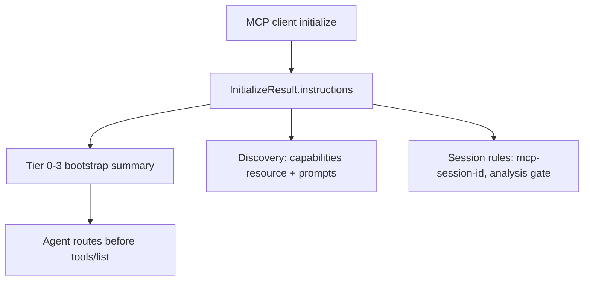

# LFG — MCP initialize instructions preamble

## Summary

Add a concise MCP `initialize` instructions preamble so agents receive tiered bootstrap guidance, discovery pointers, and session rules at connect time — closing the agent-native audit gap "Agent self-describes ⚠️ per-tool; no initialize preamble" without duplicating the full `agentdecompile://capabilities` inventory.

---

## Problem Frame

The agent-native audit (Capability Discovery 5/7) notes agents only discover AgentDecompile via per-tool hints and separate `tools/list` / `resources/read` calls. MCP SDK supports `InitializeResult.instructions`; `agentdecompile://capabilities` (PR #64) provides machine-readable inventory but is not injected at initialize. Agents miss tier routing and first-step guidance unless they read slash-command docs.

---

## Requirements

| ID | Requirement |
|----|-------------|
| R1 | `build_initialize_instructions()` in `mcp_utils/tool_reference.py` returns a concise markdown preamble |
| R2 | Preamble includes Tier 0→3 routing summary, first-step workflow (`run-file-triage` → `open-project` → analysis gate), and `agentdecompile://capabilities` URI |
| R3 | `PythonMcpServer._create_mcp_server()` passes `instructions=` to `Server(...)` |
| R4 | `AgentDecompileStdioBridge` in `bridge.py` passes same instructions (stdio + proxy clients) |
| R5 | Unit tests assert key substrings and non-empty output; optional integration assert on `init_result.instructions` |
| R6 | Audit doc updates: Context Injection rec #4 and Capability Discovery "agent self-describes" marked addressed |

---

## Scope Boundaries

- Full tool inventory in instructions (use capabilities resource instead)
- Dynamic per-session program state in preamble (remains in `projectContext` on tool responses)
- `stdio_bridge.py` unless trivial parity is needed for legacy path
- Empty-session proactive hints (separate PR #96)

### Deferred to Follow-Up Work

- Session-aware preamble variants (e.g. inject open program count after initialize)

---

## Context & Research

### Relevant Code and Patterns

- `src/agentdecompile_cli/mcp_utils/tool_reference.py` — `build_capabilities_payload()`, `_TIER_ROUTING`
- `src/agentdecompile_cli/mcp_server/server.py` — `Server(name=..., version=...)`
- `src/agentdecompile_cli/bridge.py` — `Server("AgentDecompile")` for stdio/proxy
- MCP SDK: `Server(..., instructions=...)` flows to `InitializeResult.instructions`

### Institutional Learnings

- `docs/solutions/architecture-patterns/capabilities-mcp-resource.md` — capabilities resource is bootstrap discovery; preamble should point to it
- `.cursor/commands/help.md` — long-form human reference; preamble is compressed subset

---

## Key Technical Decisions

- **Single builder function:** Reuse `_TIER_ROUTING` tier labels and `RESOURCE_URI_CAPABILITIES` to avoid drift with capabilities resource
- **Both transport surfaces:** HTTP server and stdio bridge must set instructions (proxy uses bridge.server)
- **Length budget:** Keep under ~2KB markdown — clients inject into system context

---

## Implementation Units

- U1. **Initialize instructions builder**

**Goal:** Centralize preamble text next to capabilities builder.

**Requirements:** R1, R2

**Dependencies:** None

**Files:**
- Modify: `src/agentdecompile_cli/mcp_utils/tool_reference.py`
- Test: `tests/test_initialize_instructions.py`

**Approach:**
- Add `build_initialize_instructions()` composing tier summary, bootstrap steps, discovery URIs, session/analysis-gate notes
- Include active surface profile name when available from registry helpers

**Test scenarios:**
- Happy path: returns non-empty string containing `agentdecompile://capabilities`, `open-project`, Tier 0
- Edge case: includes analysis gate mention when `get_effective_max_analysis_tier()` is set (monkeypatch env)

**Verification:**
- Unit tests pass without Ghidra

---

- U2. **Wire instructions into MCP Server constructors**

**Goal:** Expose preamble on initialize for HTTP and stdio clients.

**Requirements:** R3, R4

**Dependencies:** U1

**Files:**
- Modify: `src/agentdecompile_cli/mcp_server/server.py`
- Modify: `src/agentdecompile_cli/bridge.py`

**Approach:**
- Import `build_initialize_instructions` and pass to `Server(..., instructions=...)`
- Bridge: add package version from `agentdecompile_cli._version` for parity with HTTP server

**Test scenarios:**
- Integration: extend or add test that `initialize()` returns non-empty `instructions` (stdio fixture if available, else unit-only mock)

**Verification:**
- Both code paths import shared builder; no duplicate prose

---

- U3. **Audit and docs closure**

**Goal:** Record audit improvement.

**Requirements:** R6

**Dependencies:** U1, U2

**Files:**
- Modify: `docs/audits/2026-05-24-agent-native-audit.md`

**Approach:**
- Update Capability Discovery table: "Agent self-describes" → ✅ initialize preamble + per-tool hints
- Note Context Injection rec #4 fully addressed (resource + instructions)

**Test expectation:** none — documentation only

**Verification:**
- Audit reflects shipped behavior

---

## System-Wide Impact

- **API surface parity:** HTTP direct and stdio/proxy both return instructions
- **Unchanged invariants:** Capabilities resource payload, tools/list, projectContext injection unchanged

---

## Risks & Dependencies

| Risk | Mitigation |
|------|------------|
| Preamble drift from help.md | Derive tier labels from `_TIER_ROUTING`; point to capabilities resource for inventory |
| Instructions too long for clients | Cap length; no full tool list |

---

## Sources & References

- **Origin:** `docs/audits/2026-05-24-agent-native-audit.md`
- Related: `docs/plans/2026-05-24-lfg-capabilities-resource-c2bc.md` (PR #64)
- MCP SDK: `Server(instructions=...)`
