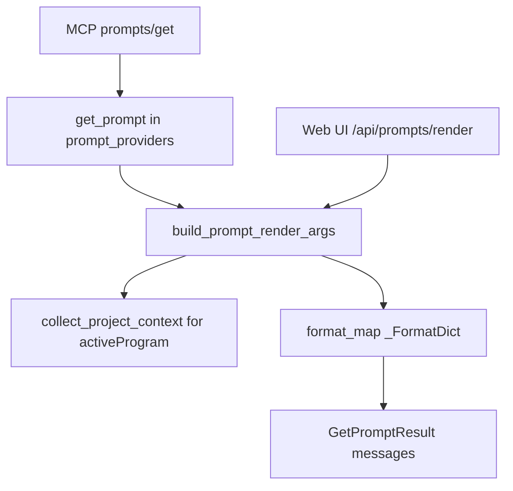

# LFG — P1-2 MCP `prompts/get` with live session substitution

## Summary

Implement the missing MCP **`prompts/get`** handler so clients can retrieve fully rendered RE workflow prompts (9 templates already advertised via `prompts/list`). Substitute session-aware defaults (`program_path`, active program) using the same rendering logic as the Web UI.

---

## Problem Frame

The agent-native audit (PR #49) lists nine MCP prompts via `prompts/list`, but **`prompts/get` is not implemented**. Web UI already renders prompt templates with argument substitution in `webui.py`; MCP clients cannot fetch rendered prompt content. This blocks prompt-native agent workflows.

---

## Requirements

- R1. **`get_prompt(name, arguments)`** returns `GetPromptResult` with rendered `PromptMessage` list for all 9 known prompts.
- R2. **Session substitution**: when `program_path` is omitted, default to the session's `activeProgram` from `collect_project_context()`; fall back to placeholder when no session programs.
- R3. **Shared render helpers**: extract `build_prompt_render_args()` and `_FormatDict` from `webui.py` into `prompt_providers.py` so MCP and Web UI stay in sync.
- R4. **`@server.get_prompt()`** wired in `server.py` using `get_current_mcp_session_id()`.
- R5. **Unknown prompt** raises clear error (MCP-compatible).
- R6. Update residual doc to mark P1-2 done; optionally update audit discovery row.

---

## Scope Boundaries

- **In scope:** `prompt_providers.py`, `server.py`, `webui.py` (dedupe imports), `tests/test_prompt_providers.py`, residual/audit docs.
- **Out of scope:** P1-3 `uiVisibility`, P1-4 proxy header, new prompt definitions, list-prompts tool changes.

### Deferred to Follow-Up Work

- Markdown footer for prompts in `response_formatter.py` (low priority).

---

## Context & Research

### Relevant Code and Patterns

- `src/agentdecompile_cli/mcp_server/prompt_providers.py` — `_PROMPTS`, `list_prompts()`
- `src/agentdecompile_cli/webui.py` — `_prompt_render_args()`, `_FormatDict`, `/api/prompts/render`
- `src/agentdecompile_cli/mcp_server/server.py` — `@server.list_prompts()` at line ~589
- `src/agentdecompile_cli/mcp_server/program_metadata.py` — `collect_project_context()`
- `tests/test_project_context.py` — unit test patterns with mocked session

---

## Key Technical Decisions

- **Centralize rendering in `prompt_providers.py`**: Web UI imports shared helpers instead of duplicating logic.
- **Session defaults via `collect_project_context`**: Use `activeProgram` for `program_path` when caller omits it; preserve Web UI placeholder `(current project)` when session is empty.
- **Required args**: Validate required prompt arguments before render; raise `ValueError` with argument name (server maps to MCP error).

---

## High-Level Technical Design

> *Directional guidance for review, not implementation specification.*

---

## Implementation Units

- U1. **Shared render helpers + get_prompt**

**Goal:** Add `build_prompt_render_args()`, `get_prompt()`, and prompt lookup helpers.

**Requirements:** R1, R2, R3, R5

**Dependencies:** None

**Files:**
- Modify: `src/agentdecompile_cli/mcp_server/prompt_providers.py`
- Modify: `src/agentdecompile_cli/webui.py`

**Approach:**
- Move `_FormatDict` and render-arg building into `prompt_providers.py` as public `build_prompt_render_args()`.
- Add `get_prompt(name, arguments, session_id)` returning `types.GetPromptResult`.
- Add `get_prompt_definition(name)` helper for lookup.
- Refactor `webui.py` to import shared helpers.

**Test scenarios:**
- Happy path: `re-scout-broad-sweep` with `analysis_target` renders `{analysis_target}` in message text.
- Edge case: omitted `program_path` + mocked session with `activeProgram=/K1/foo.exe` substitutes into template.
- Edge case: empty session uses `(current project)` placeholder.
- Error path: unknown prompt name raises.
- Error path: missing required `analysis_target` raises.

**Verification:** Unit tests pass without Ghidra/JVM.

---

- U2. **MCP server handler**

**Goal:** Wire `@server.get_prompt()` to provider.

**Requirements:** R4

**Dependencies:** U1

**Files:**
- Modify: `src/agentdecompile_cli/mcp_server/server.py`

**Approach:**
- Register `@server.get_prompt()` handler calling `prompt_providers.get_prompt(name, arguments, get_current_mcp_session_id())`.
- Add `prompts/get` to OpenAPI method enum if present.

**Test scenarios:**
- Integration: optional; unit coverage on provider is sufficient for this slice.

**Verification:** Handler registered; no import errors on server startup.

---

- U3. **Tests + docs**

**Goal:** Unit tests and tracker updates.

**Requirements:** R6

**Dependencies:** U1, U2

**Files:**
- Create: `tests/test_prompt_providers.py`
- Modify: `docs/residual-review-findings/impl-agent-native-audit-c2bc.md`
- Modify: `docs/audits/2026-05-24-agent-native-audit.md` (discovery row)

**Test scenarios:**
- Full unit suite for U1 scenarios (see above).

**Verification:**
- `uv run pytest tests/test_prompt_providers.py -m unit -q --timeout=60`
- `uv run pytest -m unit -q --timeout=120`

---

## System-Wide Impact

- **API surface parity:** Web UI render endpoint and MCP `prompts/get` share one code path.
- **Unchanged invariants:** `prompts/list` advertisement unchanged; `_PROMPTS` content unchanged.

---

## Risks & Dependencies

| Risk | Mitigation |
|------|------------|
| Web UI regression from refactor | Keep webui render endpoint behavior identical; unit tests cover substitution |
| Session id mismatch | Use same `get_current_mcp_session_id()` as tools |

---

## Sources & References

- **Origin:** `docs/residual-review-findings/impl-agent-native-audit-c2bc.md` (P1-2)
- **Audit:** `docs/audits/2026-05-24-agent-native-audit.md`
- **PR:** #49
