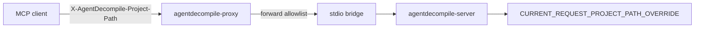

# LFG — P1-4 Forward `x-agentdecompile-project-path` on proxy

## Summary

Add **`x-agentdecompile-project-path`** to the MCP proxy's forwardable header allowlist so clients can override the backend project path per request. The backend already consumes this header; the proxy currently drops it.

---

## Problem Frame

Multi-project proxy deployments need clients to send `X-AgentDecompile-Project-Path` on each MCP request. The backend sets `CURRENT_REQUEST_PROJECT_PATH_OVERRIDE` from this header, but `proxy_server.py` `_forwardable_shared_headers()` omits it from `allowed_headers`, so client overrides never reach the backend. Env-based forwarding via `bridge._proxy_project_path_headers()` works only for proxy-process defaults, not per-client overrides.

---

## Requirements

- R1. Proxy forwards **`x-agentdecompile-project-path`** from client requests to the backend (allowlist in `_forwardable_shared_headers`).
- R2. `/api/reference` **`forwarded_headers`** and **`env_to_headers`** document the header (parity with other shared-workspace headers).
- R3. Unit tests assert the header is extracted from ASGI scope and listed in reference docs.
- R4. Mark P1-4 done in residual findings doc.

---

## Scope Boundaries

- **In scope:** `proxy_server.py`, tests, residual doc.
- **Out of scope:** Backend header handling (already implemented), bridge env merge precedence changes, P2+ audit items.

---

## Key Technical Decisions

- Add to existing **`allowed_headers`** set (lowercase key matching) — same pattern as auto-match headers.
- Extract **`forwardable_shared_headers_from_scope()`** to module level for unit testing without spinning up the proxy ASGI stack.
- Client header takes precedence over bridge env headers when both present (backend reads request header first).

---

## High-Level Technical Design



> Directional guidance for review, not implementation specification.

---

## Implementation Units

- U1. **Allowlist + module-level helper** in `proxy_server.py`
- U2. **Reference docs** — `forwarded_headers` + `env_to_headers` in `/api/reference`
- U3. **Tests** in `tests/test_proxy_forwarded_headers.py`
- U4. **Residual doc** — mark P1-4 done

## Verification

```bash
uv run pytest tests/test_proxy_forwarded_headers.py -m unit -q --timeout=60
uv run pytest -m unit -q --timeout=120
```
