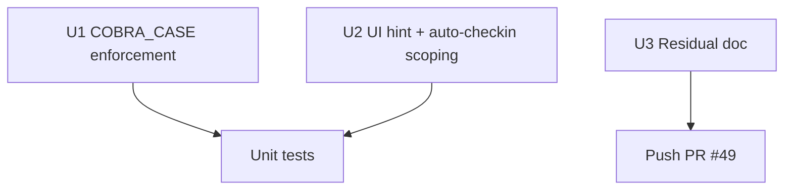

# LFG — P2-1 manage-enums polish

## Summary

Close P2-1 review follow-ups: enforce **COBRA_CASE** at runtime on enum member writes, scope **UI hints / auto-checkin** to mutating enum `action` values only, and add unit tests for formatter/conflict paths.

---

## Requirements

- R1. Reject non-COBRA_CASE member names on create/add_member/edit_member.
- R2. UI hints attach only for mutating enum actions (`create`, `add_member`, `edit_member`, `remove_member`, `delete`).
- R3. Auto-checkin skips read-only enum actions (`list`, `info`).
- R4. Unit tests for COBRA_CASE rejection, UI hint scoping, conflict payload shape.
- R5. Mark P2-1 polish items done in residual doc.

---

## Implementation Units



- U1. `require_cobra_case_member_name()` in `enums.py`; call from create/add/edit paths.
- U2. `payload_has_mutating_action()` in `program_metadata.py`; wire auto-checkin in `tool_providers.py`.
- U3. Tests in `tests/test_manage_enums.py`, `tests/test_ui_hints.py`.
- U4. Residual doc closure.

## Verification

```bash
uv run pytest tests/test_manage_enums.py tests/test_ui_hints.py -m unit -q --timeout=60
uv run pytest -m unit -q --timeout=120
```
