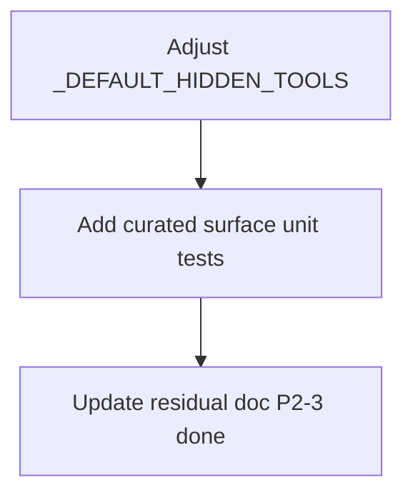

# LFG — P2-3 curated tool surface inversion

## Summary

Invert the curated MCP tool surface so **list/search primitives** are advertised on `AGENTDECOMPILE_TOOL_SURFACE=curated`, while workflow routers **`search-everything`** and **`get-function`** are demoted to `full` (and `legacy`) only.

---

## Problem Frame

Agent-native audit scores Tools as Primitives at 4/8. On curated surface, agents currently see meta-routers (`search-everything`, `get-function`) but not scoped list/search tools (`list-functions`, `search-code`, etc.), which fights the primitive-first guidance.

---

## Requirements

- R1. On **curated** surface, advertise: `list-functions`, `list-strings`, `list-imports`, `list-exports` (plus existing scoped `search-*` tools).
- R2. On **curated** surface, hide: `search-everything`, `get-function`.
- R3. **Full** and **legacy** surfaces unchanged (all non-GUI tools still advertised).
- R4. Unit tests lock curated vs full advertisement sets.
- R5. Mark P2-3 done in residual doc.

---

## Scope Boundaries

- **In scope:** `registry.py` `_DEFAULT_HIDDEN_TOOLS`, tests, residual doc.
- **Out of scope:** `primitive_tier` metadata, splitting `manage-*`, help.md overhaul.

---

## Implementation Units



- U1. Remove list primitives from `_DEFAULT_HIDDEN_TOOLS`; add `GET_FUNCTION`, `SEARCH_EVERYTHING`.
- U2. `tests/test_tool_surface_curated.py` — env-gated advertisement assertions.
- U3. Residual doc + plan status.

## Verification

```bash
uv run pytest tests/test_tool_surface_curated.py -m unit -q --timeout=60
uv run pytest -m unit -q --timeout=120
```
