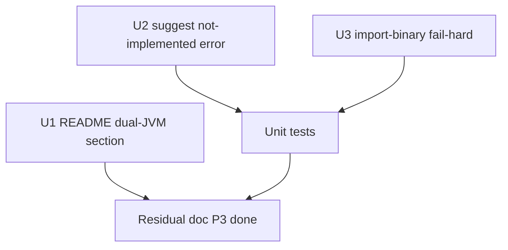

# LFG — P3 hygiene (dual-JVM docs, suggest stub, import-binary fail-hard)

## Summary

Close the remaining **P3** items from the agent-native audit on PR #49: document the headless MCP vs CodeBrowser dual-JVM workflow, make the **`suggest`** stub honest (clear not-implemented error), and **fail hard** when `import-binary` would use a temporary ProjectManager instead of silently importing into ephemeral storage.

---

## Problem Frame

P1 and P2 slices on `impl/agent-native-audit-c2bc` are shipped. Three low-effort hygiene gaps remain: agents and users lack a README checklist for GUI reload after MCP mutations; the `suggest` tool advertises an engine that does not exist; and `import-binary` can fall back to a temp project that is cleaned up, giving a false success impression.

---

## Requirements

- R1. README documents **dual-JVM model** (headless MCP JVM vs CodeBrowser) and **checkin/save before GUI reload** workflow.
- R2. **`suggest`** returns a clear **not-implemented** error when `suggestionType` is requested; no fake suggestion payload.
- R3. **`import-binary`** rejects when no session `ghidra_project` is available (after optional auto-open from project path env), with actionable next steps.
- R4. Unit tests lock suggest error behavior and import-binary fail-hard path.
- R5. Mark P3-1/2/3 done in residual doc.

---

## Scope Boundaries

- **In scope:** README, `suggestions.py`, `import_export.py`, tests, residual doc.
- **Out of scope:** Live GUI event bus, real suggestion engine, P2-1 enum polish items.

---

## Key Technical Decisions

- **P3-2:** Fail on typed suggest requests via `ValueError` with guidance to use `decompile-function` + client LLM naming conventions (AGENTS.md). Keep no-args discovery listing types for legacy callers.
- **P3-3:** Remove temp `ProjectManager` fallback branch entirely; use `create_error_response` with `nextSteps` (call `open` / set `AGENT_DECOMPILE_PROJECT_PATH`).

---

## Implementation Units



- U1. **README dual-JVM workflow** — new subsection under API/tools or connection options with checklist.
- U2. **`suggest` stub fix** — `suggestions.py` raises clear error when `suggestionType` set; update tool description.
- U3. **`import-binary` fail-hard** — remove lines ~1509–1552 temp ProjectManager branch; return error with next steps.
- U4. **Tests** — `tests/test_suggest_stub.py`, `tests/test_import_binary_project_gate.py`.
- U5. **Residual doc** — mark P3-1/2/3 done.

## Verification

```bash
uv run pytest tests/test_suggest_stub.py tests/test_import_binary_project_gate.py -m unit -q --timeout=60
uv run pytest -m unit -q --timeout=120
```
