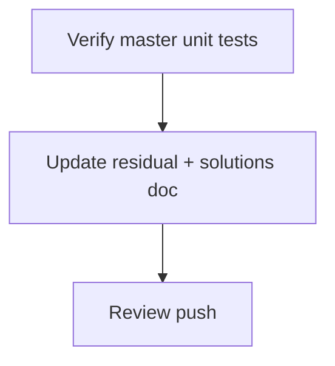

# LFG post-merge — PR #44 closeout

## Objective

After [#44](https://github.com/bolabaden/AgentDecompile/pull/44) squash-merge to `master` (`7359c6a`), run `/lfg` closeout: verify unit suite on master, update residual/solutions docs, record merge status. Live `scripts/lfg_validation.py` remains optional (Ghidra Server credentials).

## Flow



## Requirements

| ID | Requirement | Verification |
|----|-------------|--------------|
| R1 | `pytest -m unit` on master | 67+ pass |
| R2 | Residual doc marks PR #44 merged | `docs/residual-review-findings/impl-blocking-analysis-gate-c2bc.md` |
| R3 | Solutions doc notes merge SHA | `docs/solutions/integration-issues/mcp-program-analysis-gate.md` |
| R4 | Branch pushed | `origin/impl/post-merge-lfg-closeout-c2bc` |

## Scope boundaries

- **In scope:** Documentation closeout, master verification.
- **Out of scope:** Full `lfg_validation.py` driver (needs shared Ghidra Server creds); `test_lfg_e2e.py` not in tree yet.

## Implementation units

### IU1 — Update residual findings (merged)

- File: `docs/residual-review-findings/impl-blocking-analysis-gate-c2bc.md`

### IU2 — Update solutions learning with merge SHA

- File: `docs/solutions/integration-issues/mcp-program-analysis-gate.md`

## Verification

```bash
uv run pytest -m unit -q --timeout=120
```
