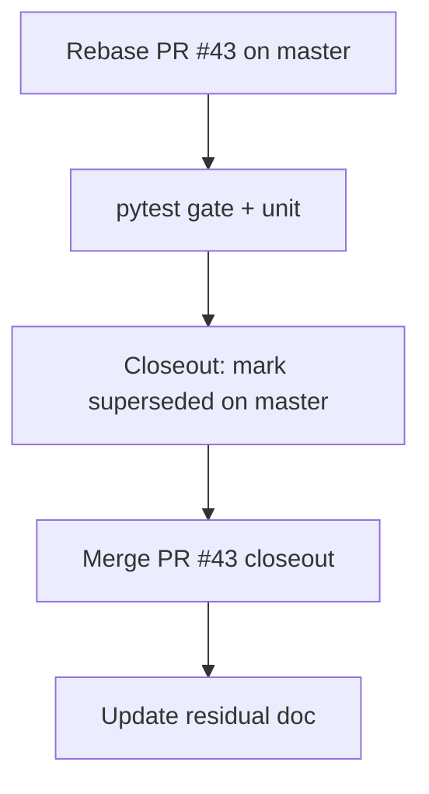

# LFG — ship PR #43 post-merge P3 hygiene

## Summary

Agent-native audit arc is complete on `master`. Initiative: merge open **PR #43** (VC gate exempt tools, import docs, LFG skill step 0). Rebased on `master` (`fa73c1f`); **all PR #43 changes already present on master** via #44/#45 and subsequent doc merges. Rebase produced zero diff; closeout documents supersession and closes the loop.

---

## Flow



---

## Requirements

- R1. Rebase `impl/post-merge-p3-hygiene-c2bc` on `master` (`fa73c1f`); resolve conflicts. **Done** — branch equals master after rebase.
- R2. VC tools remain gate-exempt; lock-map pruning intact. **Verified on master** (VC exempt tools at `program_analysis.py` lines 59–61; `_MAX_PROGRAM_LOCKS = 512` at line 39).
- R3. `IMPORT_EXPORT_GUIDE.md` and `.cursor/skills/lfg/SKILL.md` step 0 present. **Verified on master**.
- R4. Gate unit tests pass. **53 passed**.
- R5. Full unit suite passes; merge PR #43 closeout. **124 passed**.

---

## Scope Boundaries

- **In scope:** PR #43 rebase, test, merge closeout.
- **Out of scope:** Live Ghidra `/lfg` driver; agent-native audit (complete).

---

## Implementation Units

- U1. Rebase branch on master. **Done**
- U2. Run gate + unit tests. **Done — 124 passed**
- U3. Closeout doc + merge PR #43. **This commit**

## Verification

```bash
uv run pytest tests/test_program_analysis_gate.py tests/test_tool_providers_analysis_gate.py -m unit -q
uv run pytest -m unit -q --timeout=120
# Result: 53 gate tests; 124 total unit tests passed on fa73c1f base
```
