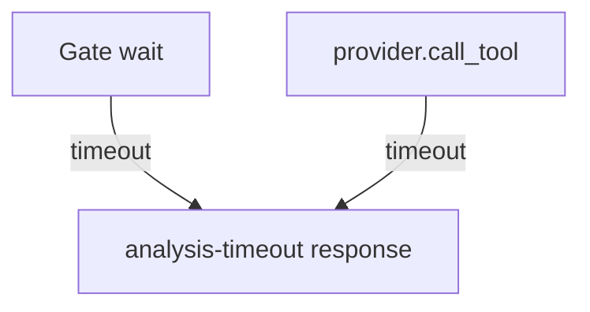

# LFG PR #44 — structured analysis-timeout from providers

## Objective

When `open` / `import-binary` (or any tool) raises `ProgramAnalysisTimeout` inside a provider, return the same structured MCP error (`state: analysis-timeout`) as the pre-dispatch gate path.

## Flow



## Requirements traceability

| ID | Requirement | Verification |
|----|-------------|--------------|
| R1 | Gate path unchanged | Existing gate unit tests |
| R2 | Provider-raised timeout maps to analysis-timeout | New unit test |
| R3 | CI green | `gh pr checks 44` |

## Implementation units

### IU1 — Shared error helper + provider catch

- File: `src/agentdecompile_cli/mcp_server/tool_providers.py`
- Add `_analysis_timeout_error_response(exc, program_path)`; use in gate and wrap `provider.call_tool`.

### IU2 — Unit test

- File: `tests/test_tool_providers_analysis_gate.py`
- Exempt tool + provider raises `ProgramAnalysisTimeout` → JSON contains `analysis-timeout`.

### IU3 — Residual doc HEAD sync after push

- File: `docs/residual-review-findings/impl-blocking-analysis-gate-c2bc.md`

## Verification

```bash
uv run pytest tests/test_tool_providers_analysis_gate.py -m unit -q
uv run pytest -m unit -q --timeout=120
```
