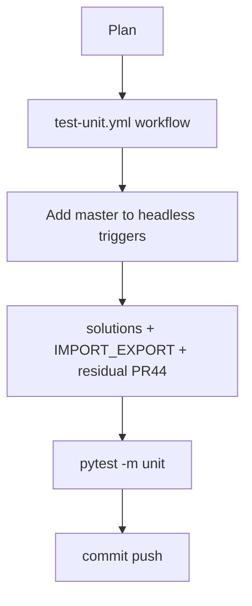

# LFG PR #44 — unit CI and gate documentation

## Objective

Give [#44](https://github.com/bolabaden/AgentDecompile/pull/44) merge confidence and durable docs: fast **unit** CI on `master` PRs, sync workflow branch filters, update `docs/solutions/` and import guide for gate follow-ups.

## Flow



## Requirements traceability

| ID | Requirement | Verification |
|----|-------------|--------------|
| R1 | Unit tests run on PR/push to `master` | `.github/workflows/test-unit.yml` |
| R2 | Existing headless workflow also triggers on `master` | `test-headless.yml` branch list |
| R3 | Solutions doc reflects PR #44 gate behavior | `docs/solutions/integration-issues/mcp-program-analysis-gate.md` |
| R4 | Import guide mentions `inSessionAnalysisPending` | `docs/IMPORT_EXPORT_GUIDE.md` |
| R5 | All unit tests pass | `uv run pytest -m unit -q` |

## Out of scope

- Ghidra-backed integration job in this slice (headless workflow unchanged aside from branches)

## Verification

```bash
uv run pytest -m unit -q --timeout=120
```
