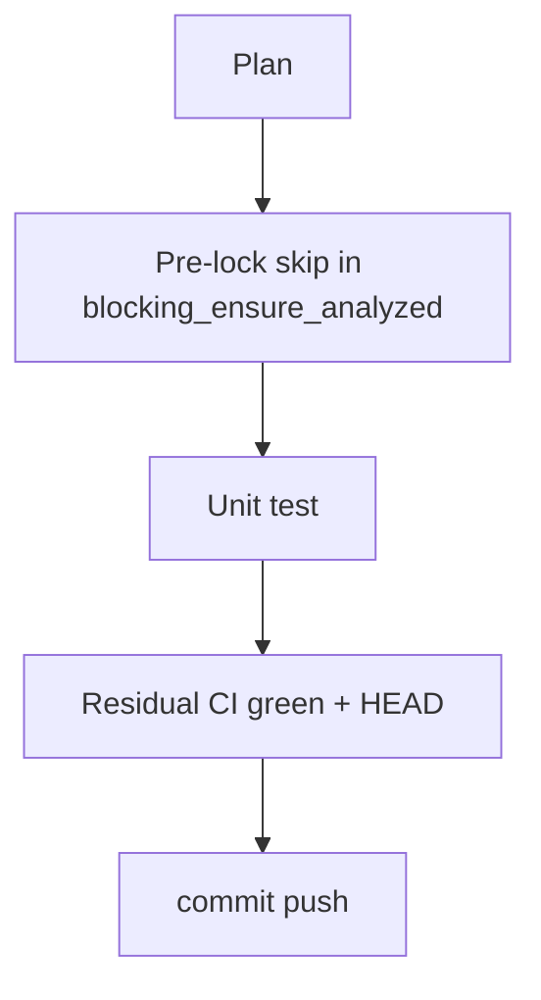

# LFG PR #44 — CI green and ensure pre-lock fast path

## Objective

Record green **Unit tests (no Ghidra)** CI on [#44](https://github.com/bolabaden/AgentDecompile/pull/44) and align `blocking_ensure_analyzed` with `wait_for_program_analysis_ready` by skipping per-program lock acquisition when the session is already marked analyzed and Ghidra agrees.

## Flow



## Requirements traceability

| ID | Requirement | Verification |
|----|-------------|--------------|
| R1 | `blocking_ensure_analyzed` returns skipped without idle/lock when session flag set and Ghidra done | Unit test |
| R2 | Residual doc notes unit CI success (`ruff` + pytest) | `impl-blocking-analysis-gate-c2bc.md` |
| R3 | No regressions | `pytest -m unit -q` |

## Verification

```bash
uv run pytest tests/test_program_analysis_gate.py -m unit -q
uv run pytest -m unit -q --timeout=120
```
