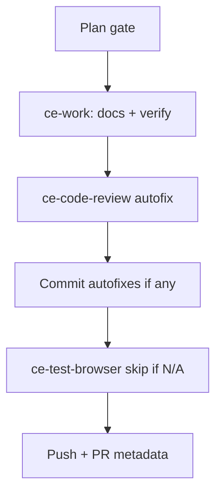

# LFG PR #44 — complete pipeline

## Objective

Finish the `/lfg` pipeline for [#44](https://github.com/bolabaden/AgentDecompile/pull/44): confirm required test CI is green on `4d7a1a2+`, refresh durable residual/merge docs, run review autofix pass, and ensure branch is pushed with PR merge-ready.

## Flow



## Requirements traceability

| ID | Requirement | Verification |
|----|-------------|--------------|
| R1 | Unit + Ghidra extension test workflows pass | `gh pr checks 44` |
| R2 | Local unit + not-e2e suites pass | `uv run pytest -m unit` and `-m "not e2e"` |
| R3 | Residual doc reflects HEAD and green required checks | `docs/residual-review-findings/impl-blocking-analysis-gate-c2bc.md` |
| R4 | No review autofixes left uncommitted | `git status` clean except `_version.py` |

## Scope boundaries

- **In scope:** Residual doc HEAD/CI notes, review autofixes, push.
- **Out of scope:** Docker image build matrix (informational), post-merge `pytest -m lfg`, `_version.py` auto bump.

## Implementation units

### IU1 — Verify CI and local tests

- Required: `pytest -m unit`, Test Ghidra Extension matrix (ubuntu/macos × 12.0/latest).
- Run local: `uv run ruff check --no-fix src/ tests/`, `uv run pytest -m unit -q --timeout=120`, `uv run pytest tests/ -m "not e2e" -q --timeout=120`.

### IU2 — Update residual findings doc

- File: `docs/residual-review-findings/impl-blocking-analysis-gate-c2bc.md`
- Set **HEAD** to current SHA; note review autofix commit `4d7a1a2`.

### IU3 — Review and ship

- `ce-code-review` with this plan; commit `fix(review):` if needed.
- Push branch; PR #44 already open.

## Test scenarios

| Scenario | Expected |
|----------|----------|
| Unit CI | SUCCESS |
| Ghidra extension tests | Four matrix jobs SUCCESS |
| Stub gate | `test_program_needs_analysis_false_for_stub_without_analysis_state` passes |
| Parity tests | No timeout on `test_canonical_tool_parity` |

## Verification

```bash
uv run ruff check --no-fix src/ tests/
uv run pytest -m unit -q --timeout=120
uv run pytest tests/ -m "not e2e" -q --timeout=120
gh pr checks 44
```
