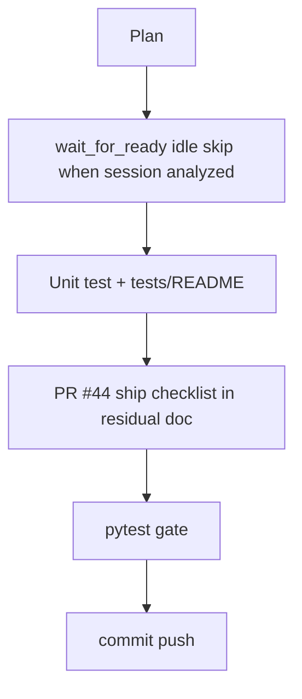

# LFG PR #44 — dispatch fast-path and ship docs

## Objective

Reduce redundant Ghidra polling on the hot MCP dispatch path when a program is already analyzed, and document how to verify/merge [#44](https://github.com/bolabaden/AgentDecompile/pull/44).

## Flow



## Requirements traceability

| ID | Requirement | Verification |
|----|-------------|--------------|
| R1 | `wait_for_program_analysis_ready` skips idle wait when session marked analyzed and Ghidra agrees | Code + unit test |
| R2 | `tests/README.md` documents gate tests and CI unit workflow | Doc section |
| R3 | Residual doc includes PR #44 merge verification commands | `impl-blocking-analysis-gate-c2bc.md` |
| R4 | No regressions | `pytest -m unit -q` |

## Verification

```bash
uv run pytest tests/test_program_analysis_gate.py tests/test_tool_providers_analysis_gate.py -m unit -q
```
