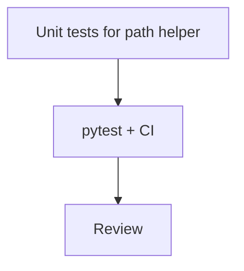

# LFG PR #44 — final ship

## Objective

Close `/lfg` for [#44](https://github.com/bolabaden/AgentDecompile/pull/44): confirm CI green on `9df2438`+, add unit tests for `resolve_domain_program_path`, review, push.

## Flow



## Requirements

| ID | Requirement | Verification |
|----|-------------|--------------|
| R1 | CI green | `gh pr checks 44` |
| R2 | `resolve_domain_program_path` edge cases tested | New unit tests |
| R3 | 60+ unit tests pass | `pytest -m unit` |

## Implementation units

### IU1 — Unit tests

- File: `tests/test_tool_providers_analysis_gate.py`
- Cases: domain pathname wins; empty pathname uses fallback; getDomainFile exception uses fallback; None domain file uses fallback.

### IU2 — Residual doc HEAD

- Update to latest SHA after push.

## Verification

```bash
uv run pytest tests/test_tool_providers_analysis_gate.py -m unit -q
```
