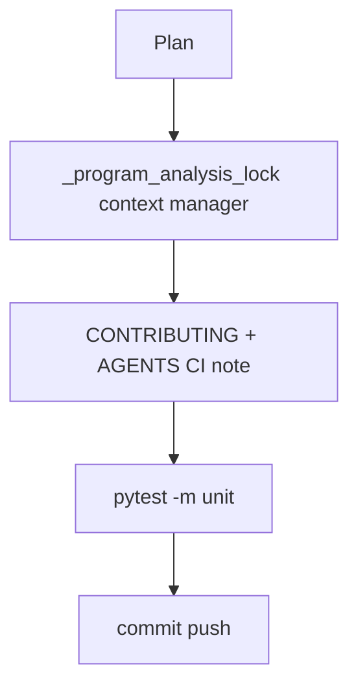

# LFG PR #44 — finalize gate maintainability and contributor docs

## Objective

Last polish on [#44](https://github.com/bolabaden/AgentDecompile/pull/44) before merge: DRY lock handling in `program_analysis.py`, contributor docs for new unit CI, plan status updates.

## Flow



## Requirements traceability

| ID | Requirement | Verification |
|----|-------------|--------------|
| R1 | Single lock acquire/release path | `_program_analysis_lock` used by ensure + wait |
| R2 | Lock still released on exceptions | Existing failure tests pass |
| R3 | Contributors know about `test-unit.yml` | `CONTRIBUTING.md` + `AGENTS.md` |
| R4 | Gate plan marked completed | `docs/plans/2026-05-24-blocking-program-analysis-gate.md` status |
| R5 | Unit tests green | `uv run pytest -m unit -q` |

## Out of scope

- CLI agent-help (already on `master`)
- LFG e2e Ghidra Server

## Verification

```bash
uv run pytest tests/test_program_analysis_gate.py tests/test_tool_providers_analysis_gate.py -m unit -q
uv run pytest -m unit -q --timeout=120
```
