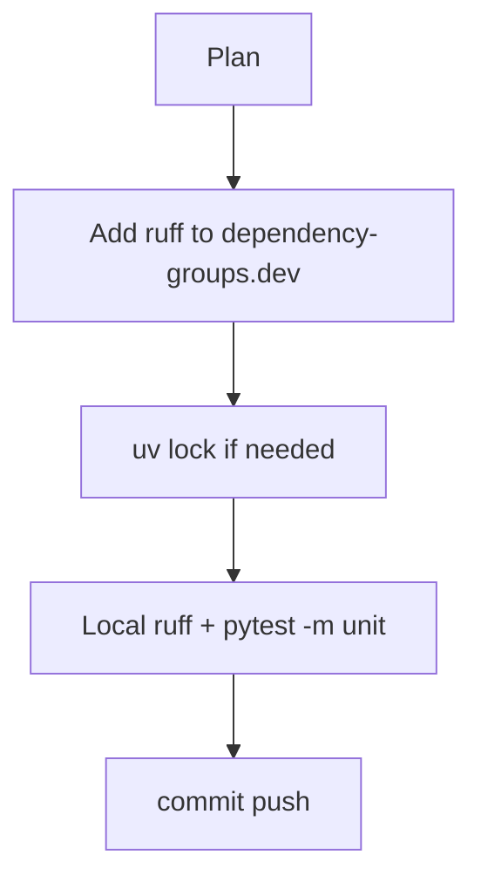

# LFG PR #44 — fix unit CI ruff spawn failure

## Objective

Restore green **Unit tests (no Ghidra)** CI on [#44](https://github.com/bolabaden/AgentDecompile/pull/44): `uv run ruff` fails in Actions with `Failed to spawn: ruff` because ruff is not in the project dev dependency group.

## Flow



## Requirements traceability

| ID | Requirement | Verification |
|----|-------------|--------------|
| R1 | `ruff` installable via `uv sync --dev` in CI | `pyproject.toml` dev group |
| R2 | `test-unit.yml` ruff step passes | GitHub Actions |
| R3 | Unit tests still pass | `pytest -m unit -q` |
| R4 | AGENTS.md notes ruff is a dev dep (not separate pip) | Doc line |

## Verification

```bash
uv sync --all-extras --dev
uv run ruff check --no-fix src/ tests/
uv run pytest -m unit -q --timeout=120
```
