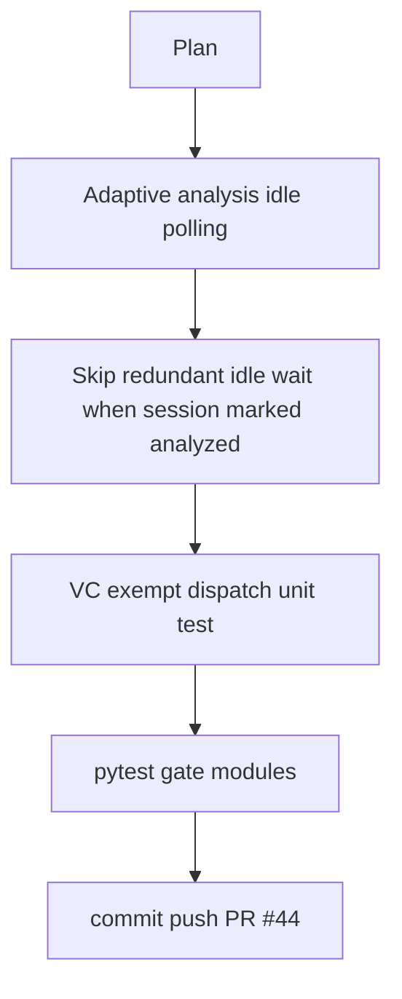

# LFG PR #44 — gate performance and dispatch polish

## Objective

Ship [#44](https://github.com/bolabaden/AgentDecompile/pull/44) with measurable **performance** and **maintainability** improvements on the blocking analysis gate, plus dispatch test coverage for VC-exempt tools.

## Flow



## Requirements traceability

| ID | Requirement | Verification |
|----|-------------|--------------|
| R1 | Faster idle detection when analysis completes early | Adaptive poll in `wait_for_program_analysis_idle` (min 50ms, max 1s backoff) |
| R2 | Avoid redundant Ghidra polls on hot path | `blocking_ensure_analyzed` skips idle wait when `ghidra_analysis_complete` and not `program_needs_analysis` |
| R3 | VC tools skip pre-dispatch gate at manager layer | `test_analysis_gate_skipped_for_exempt_checkout_program` |
| R4 | No regressions | `pytest tests/test_program_analysis_gate.py tests/test_tool_providers_analysis_gate.py -m unit` |

## Implementation units

1. `src/agentdecompile_cli/mcp_utils/program_analysis.py` — polling + ensure fast path
2. `tests/test_program_analysis_gate.py` — fast-path unit test
3. `tests/test_tool_providers_analysis_gate.py` — checkout-program exempt dispatch test

## Out of scope

- Full `pytest tests/test_lfg_e2e.py -m lfg` (requires live Ghidra Server in CI)

## Verification

```bash
uv run pytest tests/test_program_analysis_gate.py tests/test_tool_providers_analysis_gate.py -m unit -q
```
