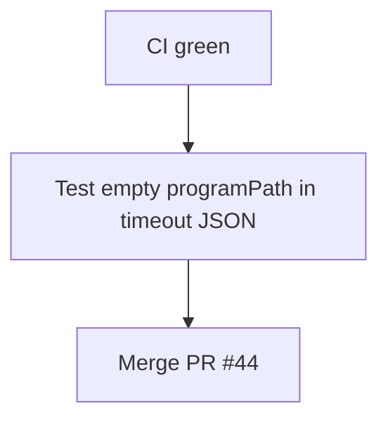

# LFG PR #44 — merge when CI green

## Objective

Complete `/lfg` for [#44](https://github.com/bolabaden/AgentDecompile/pull/44): confirm CI green on `0d682ae`, add `analysis_timeout_error_response` test for empty `programPath`, merge PR.

## Flow



## Requirements

| ID | Requirement | Verification |
|----|-------------|--------------|
| R1 | CI SUCCESS on HEAD | `gh pr checks 44` |
| R2 | Unit tests pass | `pytest -m unit` |
| R3 | Empty programPath in timeout response tested | Unit test |
| R4 | PR merged to master | `gh pr view 44` mergedAt set |

## Implementation units

### IU1 — Test `program_path=None` in `analysis_timeout_error_response`

- File: `tests/test_tool_providers_analysis_gate.py`

### IU2 — Merge PR

- `gh pr merge 44 --squash` when green and mergeable.

## Verification

```bash
uv run pytest tests/test_tool_providers_analysis_gate.py -m unit -q
gh pr checks 44
```
